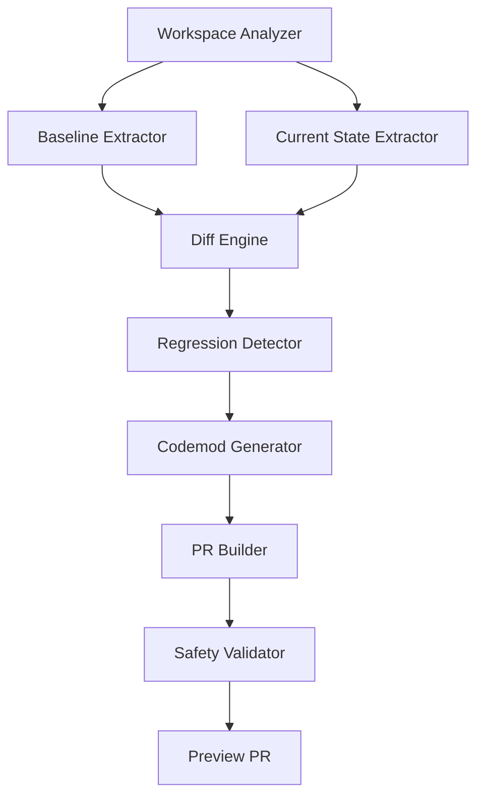

# Design Document

## Overview

The Admin Regression Audit system is designed to systematically compare two versions of the Subway Enterprise admin application and restore UI/UX improvements from the "Cursor-era" baseline while preserving new "Kiro-era" features. The system operates as a code analysis and transformation pipeline that identifies visual regressions, generates targeted fixes, and produces a preview PR for review.

The current analysis shows the admin app has a 5-tile KPI grid (Orders Today, Revenue Today, Pending, Menu Items, Avg Order Value) with sophisticated styling using CSS custom properties and a dark theme. The system needs to identify if the old baseline had 9 tiles and restore the missing ones while maintaining the existing styling system.

## Architecture

### Core Components



### Data Flow

1. **Dual Workspace Access**: System reads from both oldRoot and newRoot directories
2. **Component Extraction**: Identifies React components, CSS classes, and styling tokens
3. **Structural Analysis**: Maps KPI grids, layout patterns, and feature panels
4. **Regression Detection**: Compares structures to identify missing or degraded elements
5. **Fix Generation**: Creates targeted codemods to restore improvements
6. **Safety Validation**: Ensures changes don't break existing functionality
7. **PR Creation**: Generates preview branch with all changes

## Components and Interfaces

### 1. Workspace Analyzer

**Purpose**: Provides unified access to both workspace directories with error handling

```typescript
interface WorkspaceAnalyzer {
  readOldBaseline(path: string): Promise<FileContent | null>
  readCurrentState(path: string): Promise<FileContent | null>
  listComponents(workspace: 'old' | 'current'): Promise<ComponentInfo[]>
  extractStyleTokens(workspace: 'old' | 'current'): Promise<StyleTokens>
}

interface FileContent {
  path: string
  content: string
  type: 'tsx' | 'css' | 'ts' | 'json'
  lastModified: Date
}
```

### 2. Component Structure Extractor

**Purpose**: Analyzes React components to identify KPI grids, layouts, and feature panels

```typescript
interface ComponentStructure {
  kpiGrid: {
    tileCount: number
    tiles: KPITile[]
    gridLayout: string // CSS grid template
  }
  featurePanels: FeaturePanel[]
  stylingTokens: StyleToken[]
  iconAlignments: IconAlignment[]
}

interface KPITile {
  id: string
  title: string
  dataSource: string
  iconSvg: string
  accentColor: string
  position: { row: number; col: number }
}
```

### 3. Regression Detector

**Purpose**: Identifies specific regressions by comparing old and current structures

```typescript
interface RegressionReport {
  kpiRegressions: {
    missingTiles: KPITile[]
    reducedGrid: boolean
    lostStyling: string[]
  }
  stylingRegressions: {
    missingTokens: StyleToken[]
    iconOverlaps: IconOverlap[]
    spacingIssues: SpacingIssue[]
  }
  featureRegressions: {
    lostPanels: FeaturePanel[]
    degradedComponents: ComponentRegression[]
  }
}
```

### 4. Codemod Generator

**Purpose**: Creates targeted code transformations to restore improvements

```typescript
interface CodemodPlan {
  kpiRestoration: {
    addMissingTiles: KPITileAddition[]
    updateGridLayout: GridLayoutChange
    restoreDataWiring: DataWiringFix[]
  }
  stylingFixes: {
    restoreTokens: StyleTokenRestore[]
    fixIconAlignment: IconAlignmentFix[]
    applySpacing: SpacingFix[]
  }
  componentRestoration: {
    restoreFeaturePanels: FeaturePanelRestore[]
    addEmptyStates: EmptyStateAddition[]
  }
}
```

## Data Models

### KPI Tile Configuration

Based on current analysis, the system uses a 5-tile grid. The old baseline may have had 9 tiles:

```typescript
interface KPIConfiguration {
  currentTiles: [
    'ordersToday',
    'revenueToday', 
    'pendingOrders',
    'menuItems',
    'avgOrderValue'
  ]
  potentialMissingTiles: [
    'totalStores',
    'activeUsers', 
    'customerSatisfaction',
    'inventoryAlerts'
  ]
  gridLayout: {
    current: 'repeat(4, minmax(0,1fr))' // 4-column responsive
    target: 'repeat(3, minmax(0,1fr))'   // 3x3 grid for 9 tiles
  }
}
```

### Styling Token System

The current system uses CSS custom properties with a sophisticated dark theme:

```typescript
interface StyleTokenSystem {
  colors: {
    background: '--s-bg: #0f1724'
    panel: '--s-panel: #141e31'
    accent: '--s-accent: #00a651'
    accentSecondary: '--s-accent-2: #ffd100'
  }
  spacing: {
    gap: '--s-gap: 12px'
    radius: '--s-radius: 12px'
  }
  shadows: {
    card: '--s-shadow: 0 8px 24px rgba(0,0,0,.35)'
  }
}
```

### Component Restoration Patterns

```typescript
interface RestorationPattern {
  kpiTileTemplate: {
    structure: 's-card with s-cardAccent'
    iconBlob: 's-blob with appropriate color variant'
    typography: 's-k for label, s-v for value, s-sub for subtitle'
    dataBinding: 'kpis.{propertyName} with fallback to "—"'
  }
  featurePanelTemplate: {
    structure: 's-panelCard within s-panGrid'
    header: 's-panelT for panel title'
    content: 'appropriate list/grid/action structure'
  }
}
```

## Error Handling

### File Access Errors

```typescript
interface ErrorHandling {
  missingFiles: {
    strategy: 'graceful degradation'
    action: 'report missing components, continue with available data'
  }
  parseErrors: {
    strategy: 'skip and log'
    action: 'add to needs-human-review section'
  }
  pathResolution: {
    strategy: 'absolute path fallback'
    action: 'try both relative and absolute paths'
  }
}
```

### Codemod Safety

```typescript
interface SafetyChecks {
  typeScriptValidation: {
    check: 'ensure imports and types are valid'
    action: 'add missing imports, preserve type safety'
  }
  dataLayerCompatibility: {
    check: 'verify data sources exist or provide safe mocks'
    action: 'use existing kpis object structure, add fallbacks'
  }
  preserveNewFeatures: {
    check: 'identify telemetry hooks, new components'
    action: 'leave untouched, integrate around them'
  }
}
```

## Testing Strategy

### Component Structure Validation

```typescript
interface TestingApproach {
  structureTests: {
    kpiGridValidation: 'verify tile count and layout match expectations'
    stylingTokenPresence: 'ensure all required CSS custom properties exist'
    componentIntegrity: 'validate React component structure and props'
  }
  regressionDetection: {
    beforeAfterComparison: 'snapshot testing of component structures'
    visualRegressionPrevention: 'ensure styling tokens are properly applied'
    dataFlowValidation: 'verify KPI data binding works correctly'
  }
  codemodValidation: {
    syntaxValidation: 'ensure generated code is syntactically correct'
    typeChecking: 'verify TypeScript compilation succeeds'
    integrationTesting: 'test that restored components integrate properly'
  }
}
```

### Safety Testing

```typescript
interface SafetyValidation {
  preservationTests: {
    newFeatureIntegrity: 'ensure telemetry and hooks remain functional'
    dataLayerStability: 'verify existing API calls and data flow unchanged'
    routingStability: 'ensure no route changes or navigation breaks'
  }
  rollbackCapability: {
    changeTracking: 'maintain detailed change log for easy rollback'
    atomicOperations: 'ensure changes can be reverted cleanly'
    backupValidation: 'verify current state is preserved before changes'
  }
}
```

### Implementation Validation

The system will validate changes through multiple layers:

1. **Syntax Validation**: Ensure all generated code is syntactically correct
2. **Type Checking**: Verify TypeScript compilation succeeds
3. **Component Integration**: Test that restored components work with existing data layer
4. **Visual Validation**: Ensure styling improvements are properly applied
5. **Feature Preservation**: Verify new Kiro features remain intact

### Confidence Scoring

Each change will be assigned a confidence score:

- **High (0.9-1.0)**: Simple styling token restoration, straightforward component additions
- **Medium (0.7-0.8)**: KPI tile restoration with data wiring, layout modifications
- **Low (0.5-0.6)**: Complex component restoration, data layer integration
- **Needs Review (<0.5)**: Ambiguous changes, potential breaking modifications

Changes with confidence < 0.8 will be flagged for human review in the PR description.