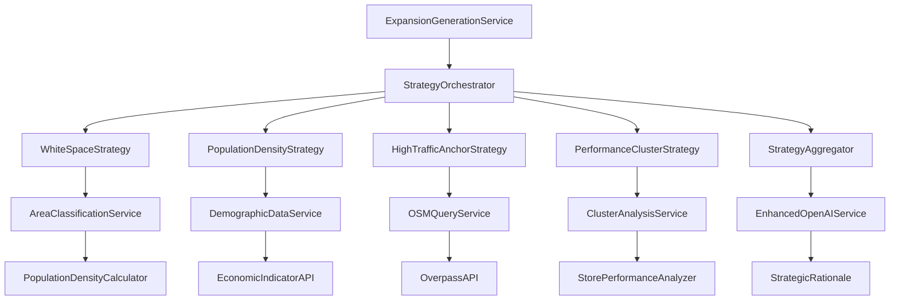

# Advanced Expansion Strategies - Design Document

## Overview

This design implements four sophisticated expansion strategies that transform the current basic scoring system into an executive-grade strategic planning tool. The system will analyze coverage gaps (White Space), economic indicators (Population-Density Bias), natural footfall generators (High-Traffic Anchors), and successful patterns (Performance Clustering). Each strategy contributes weighted scores that combine into comprehensive, business-aligned recommendations with AI-generated rationales explaining the strategic logic.

## Architecture

### High-Level Strategy Pipeline

```
Candidate Location
    ↓
┌─────────────────────────────────────────────────────────┐
│ Strategy Scoring Pipeline                               │
│                                                         │
│ 1. White Space Strategy                                 │
│    ├─ Calculate nearest store distance                  │
│    ├─ Classify urban/rural (population density)        │
│    ├─ Apply coverage radius thresholds                 │
│    └─ Boost underserved areas                          │
│                                                         │
│ 2. Population-Density Bias                             │
│    ├─ Load demographic data (population, growth, income)│
│    ├─ Calculate economic score                          │
│    ├─ Apply growth trajectory modifiers                │
│    └─ Weight by economic potential                     │
│                                                         │
│ 3. High-Traffic Anchors                                │
│    ├─ Query OSM for transport hubs                     │
│    ├─ Query OSM for educational institutions           │
│    ├─ Query OSM for retail centers                     │
│    ├─ Query OSM for service stations                   │
│    └─ Apply proximity boosts with diminishing returns  │
│                                                         │
│ 4. Performance Clustering                              │
│    ├─ Identify high-performer clusters                 │
│    ├─ Calculate distance to clusters                   │
│    ├─ Apply radial expansion scoring                   │
│    └─ Match demographic patterns                       │
│                                                         │
│ 5. Strategy Aggregation                                │
│    ├─ Weight individual strategy scores                │
│    ├─ Normalize and combine                            │
│    ├─ Generate strategy breakdown                      │
│    └─ Create executive rationale                       │
└─────────────────────────────────────────────────────────┘
    ↓
Enhanced Suggestion with Strategic Context
```

### Component Architecture



## Components and Interfaces

### 1. Strategy Orchestrator

```typescript
export interface StrategyConfig {
  whiteSpaceWeight: number;
  economicWeight: number;
  anchorWeight: number;
  clusterWeight: number;
  enabledStrategies: StrategyType[];
}

export interface StrategyScore {
  strategyType: StrategyType;
  score: number;
  confidence: number;
  reasoning: string;
  metadata: Record<string, any>;
}

export interface StrategicSuggestion extends ExpansionSuggestionData {
  strategyBreakdown: StrategyScore[];
  dominantStrategy: StrategyType;
  strategicClassification: 'white_space' | 'economic_growth' | 'anchor_proximity' | 'cluster_expansion' | 'multi_strategy';
  executiveSummary: string;
}

export class StrategyOrchestrator {
  private strategies: Map<StrategyType, ExpansionStrategy>;
  private config: StrategyConfig;
  
  constructor(config: StrategyConfig) {
    this.config = config;
    this.initializeStrategies();
  }
  
  /**
   * Apply all enabled strategies to a candidate location
   */
  async scoreCandidate(
    candidate: ScoredCell,
    context: ExpansionContext
  ): Promise<StrategicSuggestion>;
  
  /**
   * Aggregate strategy scores using configured weights
   */
  private aggregateScores(scores: StrategyScore[]): number;
  
  /**
   * Determine the dominant strategy for executive summary
   */
  private identifyDominantStrategy(scores: StrategyScore[]): StrategyType;
}
```

### 2. White Space Strategy

```typescript
export interface CoverageAnalysis {
  nearestStoreDistance: number;
  areaClassification: 'urban' | 'suburban' | 'rural';
  coverageRadius: number;
  isWhiteSpace: boolean;
  populationInArea: number;
  underservedBoost: number;
}

export class WhiteSpaceStrategy implements ExpansionStrategy {
  private areaClassifier: AreaClassificationService;
  
  /**
   * Analyze coverage gaps and boost underserved areas
   */
  async scoreCandidate(
    candidate: ScoredCell,
    stores: Store[],
    context: ExpansionContext
  ): Promise<StrategyScore>;
  
  /**
   * Calculate coverage radius based on area classification
   */
  private getCoverageRadius(classification: AreaClassification): number;
  
  /**
   * Boost score for underserved high-population areas
   */
  private calculateUnderservedBoost(
    analysis: CoverageAnalysis
  ): number;
}

export class AreaClassificationService {
  /**
   * Classify area as urban/suburban/rural based on population density
   */
  async classifyArea(lat: number, lng: number): Promise<{
    classification: 'urban' | 'suburban' | 'rural';
    populationDensity: number;
    populationInRadius: number;
  }>;
  
  /**
   * Get population data for area analysis
   */
  private async getPopulationData(
    lat: number,
    lng: number,
    radiusKm: number
  ): Promise<PopulationData>;
}
```

### 3. Population-Density Strategy

```typescript
export interface EconomicIndicators {
  population: number;
  populationGrowthRate: number; // Annual %
  medianIncome: number;
  nationalMedianIncome: number;
  incomeIndex: number; // local/national ratio
  economicScore: number;
  growthTrajectory: 'high_growth' | 'moderate_growth' | 'stable' | 'declining';
}

export class PopulationDensityStrategy implements ExpansionStrategy {
  private demographicService: DemographicDataService;
  
  /**
   * Score based on economic potential and growth trajectory
   */
  async scoreCandidate(
    candidate: ScoredCell,
    stores: Store[],
    context: ExpansionContext
  ): Promise<StrategyScore>;
  
  /**
   * Calculate economic score: population × (1 + growth) × income_index
   */
  private calculateEconomicScore(indicators: EconomicIndicators): number;
  
  /**
   * Apply growth trajectory modifiers
   */
  private applyGrowthModifiers(
    baseScore: number,
    trajectory: string
  ): number;
}

export class DemographicDataService {
  private cache: Map<string, EconomicIndicators>;
  
  /**
   * Get economic indicators for a location
   */
  async getEconomicIndicators(
    lat: number,
    lng: number
  ): Promise<EconomicIndicators>;
  
  /**
   * Load demographic data from CSV or API
   */
  async loadDemographicData(source: DataSource): Promise<void>;
  
  /**
   * Calculate income index relative to national median
   */
  private calculateIncomeIndex(
    localIncome: number,
    nationalMedian: number
  ): number;
}
```

### 4. High-Traffic Anchor Strategy

```typescript
export interface AnchorLocation {
  type: 'transport' | 'education' | 'retail' | 'service_station';
  subtype: string; // 'railway_station', 'university', 'shopping_mall', etc.
  name: string;
  lat: number;
  lng: number;
  distance: number;
  size: 'major' | 'medium' | 'minor';
  estimatedFootfall: number;
  boost: number;
}

export interface AnchorAnalysis {
  anchors: AnchorLocation[];
  totalBoost: number;
  anchorCount: number;
  dominantAnchorType: string;
  isSuperLocation: boolean; // 3+ anchors within 500m
}

export class HighTrafficAnchorStrategy implements ExpansionStrategy {
  private osmService: OSMQueryService;
  
  /**
   * Score based on proximity to high-traffic anchors
   */
  async scoreCandidate(
    candidate: ScoredCell,
    stores: Store[],
    context: ExpansionContext
  ): Promise<StrategyScore>;
  
  /**
   * Find all anchors within proximity thresholds
   */
  private async findNearbyAnchors(
    lat: number,
    lng: number
  ): Promise<AnchorLocation[]>;
  
  /**
   * Calculate composite anchor score with diminishing returns
   */
  private calculateAnchorScore(anchors: AnchorLocation[]): number;
}

export class OSMQueryService {
  private overpassAPI: OverpassAPI;
  private cache: Map<string, OSMFeature[]>;
  
  /**
   * Query OSM for specific POI types near location
   */
  async queryPOIs(
    lat: number,
    lng: number,
    radius: number,
    poiTypes: string[]
  ): Promise<OSMFeature[]>;
  
  /**
   * Get transport hubs (stations, terminals, stops)
   */
  async getTransportHubs(
    lat: number,
    lng: number,
    radius: number
  ): Promise<OSMFeature[]>;
  
  /**
   * Get educational institutions
   */
  async getEducationalInstitutions(
    lat: number,
    lng: number,
    radius: number
  ): Promise<OSMFeature[]>;
  
  /**
   * Get retail centers and shopping areas
   */
  async getRetailCenters(
    lat: number,
    lng: number,
    radius: number
  ): Promise<OSMFeature[]>;
  
  /**
   * Get service stations and motorway services
   */
  async getServiceStations(
    lat: number,
    lng: number,
    radius: number
  ): Promise<OSMFeature[]>;
}
```

### 5. Performance Clustering Strategy

```typescript
export interface PerformanceCluster {
  id: string;
  centroid: [number, number];
  radius: number;
  stores: Store[];
  averageTurnover: number;
  storeCount: number;
  strength: number; // 0-1 based on performance and density
  demographics: ClusterDemographics;
  anchorPatterns: string[]; // Common anchor types in cluster
}

export interface ClusterProximityAnalysis {
  nearestCluster: PerformanceCluster;
  distanceToCluster: number;
  clusterBoost: number;
  patternMatch: number; // 0-1 similarity to cluster characteristics
  patternMatchReasons: string[];
}

export class PerformanceClusterStrategy implements ExpansionStrategy {
  private clusterAnalyzer: ClusterAnalysisService;
  
  /**
   * Score based on proximity to high-performing clusters
   */
  async scoreCandidate(
    candidate: ScoredCell,
    stores: Store[],
    context: ExpansionContext
  ): Promise<StrategyScore>;
  
  /**
   * Apply distance decay from cluster center
   */
  private calculateClusterProximityBoost(
    distance: number,
    cluster: PerformanceCluster
  ): number;
  
  /**
   * Calculate pattern match score
   */
  private calculatePatternMatch(
    candidate: ScoredCell,
    cluster: PerformanceCluster,
    context: ExpansionContext
  ): number;
}

export class ClusterAnalysisService {
  private clusters: PerformanceCluster[];
  
  /**
   * Identify clusters of high-performing stores
   */
  async identifyClusters(stores: Store[]): Promise<PerformanceCluster[]>;
  
  /**
   * Analyze demographic patterns within clusters
   */
  async analyzeClusterDemographics(
    cluster: PerformanceCluster
  ): Promise<ClusterDemographics>;
  
  /**
   * Find common anchor patterns in clusters
   */
  async analyzeAnchorPatterns(
    cluster: PerformanceCluster
  ): Promise<string[]>;
  
  /**
   * Calculate cluster strength score
   */
  private calculateClusterStrength(
    stores: Store[],
    averageTurnover: number
  ): number;
}
```

### 6. Strategy Aggregation and AI Enhancement

```typescript
export interface StrategyBreakdown {
  whiteSpaceScore: number;
  economicScore: number;
  anchorScore: number;
  clusterScore: number;
  weightedTotal: number;
  dominantStrategy: StrategyType;
  strategicClassification: string;
}

export class StrategyAggregator {
  /**
   * Combine strategy scores using configured weights
   */
  aggregateScores(
    scores: StrategyScore[],
    weights: StrategyConfig
  ): StrategyBreakdown;
  
  /**
   * Normalize scores to 0-1 range
   */
  private normalizeScores(scores: StrategyScore[]): StrategyScore[];
  
  /**
   * Identify strategic classification
   */
  private classifySuggestion(breakdown: StrategyBreakdown): string;
}

export class EnhancedOpenAIService extends OpenAIRationaleService {
  /**
   * Generate strategy-aware rationale
   */
  async generateStrategicRationale(
    context: RationaleContext,
    strategyBreakdown: StrategyBreakdown,
    anchorAnalysis?: AnchorAnalysis,
    clusterAnalysis?: ClusterProximityAnalysis,
    economicIndicators?: EconomicIndicators
  ): Promise<StrategicRationaleOutput>;
  
  /**
   * Build enhanced prompt with strategic context
   */
  private buildStrategicPrompt(
    context: RationaleContext,
    strategyData: StrategyData
  ): string;
}

export interface StrategicRationaleOutput extends RationaleOutput {
  executiveSummary: string;
  strategicHighlights: string[];
  riskFactors: string[];
  competitiveAdvantage: string;
}
```

## Data Models

### Enhanced Suggestion Data Model

```typescript
export interface StrategicExpansionSuggestion extends ExpansionSuggestionData {
  // Strategy scoring
  strategyBreakdown: {
    whiteSpace: {
      score: number;
      isWhiteSpace: boolean;
      nearestStoreKm: number;
      areaClassification: string;
      populationInArea: number;
    };
    economic: {
      score: number;
      population: number;
      growthRate: number;
      medianIncome: number;
      incomeIndex: number;
      growthTrajectory: string;
    };
    anchors: {
      score: number;
      anchorCount: number;
      anchors: AnchorLocation[];
      dominantAnchorType: string;
      isSuperLocation: boolean;
    };
    clustering: {
      score: number;
      nearestClusterKm: number;
      clusterStrength: number;
      patternMatch: number;
      patternMatchReasons: string[];
    };
  };
  
  // Strategic classification
  dominantStrategy: 'white_space' | 'economic_growth' | 'anchor_proximity' | 'cluster_expansion';
  strategicClassification: string;
  executiveSummary: string;
  
  // Enhanced rationale
  strategicRationale: {
    executiveSummary: string;
    strategicHighlights: string[];
    riskFactors: string[];
    competitiveAdvantage: string;
    dataCompleteness: number;
  };
}
```

### Database Schema Extensions

```prisma
// Demographic data cache
model DemographicCache {
  id                String   @id @default(cuid())
  coordinateHash    String   @unique
  lat               Float
  lng               Float
  population        Int?
  populationGrowthRate Float?
  medianIncome      Float?
  nationalMedianIncome Float?
  incomeIndex       Float?
  areaClassification String? // 'urban', 'suburban', 'rural'
  dataSource        String   // 'csv', 'api', 'estimated'
  expiresAt         DateTime
  createdAt         DateTime @default(now())
  
  @@index([coordinateHash])
  @@index([expiresAt])
}

// OSM POI cache
model OSMPOICache {
  id              String   @id @default(cuid())
  coordinateHash  String   @unique
  lat             Float
  lng             Float
  radius          Int
  poiType         String   // 'transport', 'education', 'retail', 'service'
  features        String   // JSON array of OSM features
  featureCount    Int
  expiresAt       DateTime
  createdAt       DateTime @default(now())
  
  @@index([coordinateHash, poiType])
  @@index([expiresAt])
}

// Performance cluster cache
model PerformanceCluster {
  id                String   @id @default(cuid())
  region            String   // For regional cluster analysis
  centroidLat       Float
  centroidLng       Float
  radius            Float
  storeIds          String   // JSON array of store IDs
  storeCount        Int
  averageTurnover   Float
  strength          Float
  demographics      String   // JSON cluster demographics
  anchorPatterns    String   // JSON array of common anchor types
  calculatedAt      DateTime @default(now())
  expiresAt         DateTime
  
  @@index([region])
  @@index([expiresAt])
}

// Strategy scoring cache
model StrategyScoringCache {
  id                String   @id @default(cuid())
  coordinateHash    String   @unique
  lat               Float
  lng               Float
  whiteSpaceScore   Float?
  economicScore     Float?
  anchorScore       Float?
  clusterScore      Float?
  strategyBreakdown String   // JSON detailed breakdown
  dominantStrategy  String?
  expiresAt         DateTime
  createdAt         DateTime @default(now())
  
  @@index([coordinateHash])
  @@index([expiresAt])
}
```

## Data Integration Strategy

### 1. Demographic Data Sources

```typescript
export interface DataSource {
  type: 'csv' | 'api' | 'database';
  source: string;
  format: DataFormat;
  updateFrequency: 'daily' | 'weekly' | 'monthly' | 'quarterly';
}

export class DemographicDataLoader {
  /**
   * Load population data from CSV files
   */
  async loadFromCSV(filePath: string): Promise<DemographicRecord[]>;
  
  /**
   * Load data from national statistics API
   */
  async loadFromAPI(apiConfig: APIConfig): Promise<DemographicRecord[]>;
  
  /**
   * Validate and normalize demographic data
   */
  private validateData(records: DemographicRecord[]): ValidationResult;
}
```

### 2. OpenStreetMap Integration

```typescript
export class OverpassAPI {
  private readonly OVERPASS_URL = 'https://overpass-api.de/api/interpreter';
  private rateLimiter: RateLimiter;
  
  /**
   * Execute Overpass QL query
   */
  async query(overpassQL: string): Promise<OSMResponse>;
  
  /**
   * Build query for POI types near location
   */
  buildPOIQuery(
    lat: number,
    lng: number,
    radius: number,
    poiTypes: string[]
  ): string;
  
  /**
   * Handle rate limiting and retries
   */
  private async executeWithRetry(query: string): Promise<OSMResponse>;
}
```

## Performance Considerations

### 1. Caching Strategy

```typescript
export class StrategyCacheManager {
  // Cache layers with different TTLs
  private demographicCache: Map<string, DemographicData>; // 90 days
  private osmCache: Map<string, OSMFeature[]>; // 30 days
  private clusterCache: Map<string, PerformanceCluster[]>; // 7 days
  private strategyCache: Map<string, StrategyScore[]>; // 24 hours
  
  /**
   * Get cached strategy scores
   */
  async getCachedScores(
    coordinateHash: string
  ): Promise<StrategyScore[] | null>;
  
  /**
   * Cache strategy scores with appropriate TTL
   */
  async cacheScores(
    coordinateHash: string,
    scores: StrategyScore[]
  ): Promise<void>;
}
```

### 2. Parallel Processing

```typescript
export class ParallelStrategyProcessor {
  /**
   * Execute all strategies in parallel for better performance
   */
  async processStrategiesParallel(
    candidate: ScoredCell,
    context: ExpansionContext
  ): Promise<StrategyScore[]>;
  
  /**
   * Batch process multiple candidates
   */
  async processCandidateBatch(
    candidates: ScoredCell[],
    context: ExpansionContext
  ): Promise<StrategicSuggestion[]>;
}
```

### 3. API Rate Limiting

```typescript
export class APIRateLimiter {
  private osmLimiter: RateLimiter; // 1 req/sec for Overpass
  private demographicLimiter: RateLimiter; // Varies by provider
  
  /**
   * Execute API call with rate limiting
   */
  async executeWithLimit(
    apiType: 'osm' | 'demographic',
    apiCall: () => Promise<any>
  ): Promise<any>;
}
```

## Configuration Management

### Environment Variables

```bash
# Strategy Weights (must sum to 1.0)
EXPANSION_WHITE_SPACE_WEIGHT=0.25
EXPANSION_ECONOMIC_WEIGHT=0.25
EXPANSION_ANCHOR_WEIGHT=0.25
EXPANSION_CLUSTER_WEIGHT=0.25

# Coverage Radius Configuration
EXPANSION_URBAN_COVERAGE_KM=12.5
EXPANSION_SUBURBAN_COVERAGE_KM=17.5
EXPANSION_RURAL_COVERAGE_KM=25

# Population Density Thresholds (people per km²)
EXPANSION_URBAN_DENSITY_THRESHOLD=400
EXPANSION_SUBURBAN_DENSITY_THRESHOLD=150

# Anchor Proximity Thresholds (meters)
EXPANSION_TRANSPORT_PROXIMITY_M=500
EXPANSION_EDUCATION_PROXIMITY_M=600
EXPANSION_RETAIL_PROXIMITY_M=400
EXPANSION_SERVICE_PROXIMITY_M=200

# Growth Rate Thresholds (annual %)
EXPANSION_HIGH_GROWTH_THRESHOLD=2.0
EXPANSION_DECLINING_THRESHOLD=-0.5

# Cluster Analysis
EXPANSION_CLUSTER_MIN_STORES=3
EXPANSION_CLUSTER_MAX_RADIUS_KM=15
EXPANSION_HIGH_PERFORMER_PERCENTILE=75

# Performance Tuning
EXPANSION_STRATEGY_CACHE_TTL_HOURS=24
EXPANSION_DEMOGRAPHIC_CACHE_TTL_DAYS=90
EXPANSION_OSM_CACHE_TTL_DAYS=30
EXPANSION_MAX_PARALLEL_STRATEGIES=4

# Data Sources
EXPANSION_DEMOGRAPHIC_DATA_SOURCE=csv
EXPANSION_DEMOGRAPHIC_CSV_PATH=/data/demographics.csv
EXPANSION_OSM_OVERPASS_URL=https://overpass-api.de/api/interpreter
EXPANSION_OSM_RATE_LIMIT_PER_SEC=1
```

## Error Handling and Resilience

### 1. Graceful Degradation

```typescript
export class StrategyErrorHandler {
  /**
   * Handle strategy failures gracefully
   */
  async handleStrategyFailure(
    strategy: StrategyType,
    error: Error,
    candidate: ScoredCell
  ): Promise<StrategyScore>;
  
  /**
   * Provide fallback scoring when data unavailable
   */
  private generateFallbackScore(
    strategy: StrategyType,
    candidate: ScoredCell
  ): StrategyScore;
}
```

### 2. Data Quality Validation

```typescript
export class DataQualityValidator {
  /**
   * Validate demographic data completeness
   */
  validateDemographicData(data: DemographicData): ValidationResult;
  
  /**
   * Validate OSM data quality
   */
  validateOSMData(features: OSMFeature[]): ValidationResult;
  
  /**
   * Check for data freshness
   */
  checkDataFreshness(timestamp: Date, maxAge: number): boolean;
}
```

## Testing Strategy

### 1. Strategy Unit Tests

```typescript
describe('WhiteSpaceStrategy', () => {
  it('should identify white space areas correctly');
  it('should apply appropriate coverage radius by area type');
  it('should boost underserved high-population areas');
});

describe('PopulationDensityStrategy', () => {
  it('should calculate economic score correctly');
  it('should apply growth trajectory modifiers');
  it('should handle missing demographic data gracefully');
});

describe('HighTrafficAnchorStrategy', () => {
  it('should find nearby anchors within thresholds');
  it('should apply diminishing returns for multiple anchors');
  it('should identify super locations correctly');
});

describe('PerformanceClusterStrategy', () => {
  it('should identify high-performer clusters');
  it('should apply distance decay correctly');
  it('should match demographic patterns');
});
```

### 2. Integration Tests

```typescript
describe('Strategy Integration', () => {
  it('should process all strategies for a candidate');
  it('should aggregate scores with correct weights');
  it('should generate strategic rationale');
  it('should handle parallel processing correctly');
});
```

### 3. Performance Tests

```typescript
describe('Performance', () => {
  it('should process 100 candidates within 30 seconds');
  it('should achieve >80% cache hit rate on repeat runs');
  it('should handle OSM API rate limits gracefully');
});
```

## Deployment Considerations

### 1. Data Preparation

```bash
# Prepare demographic data
./scripts/prepare-demographic-data.sh

# Validate data quality
./scripts/validate-data-sources.sh

# Pre-populate caches
./scripts/warm-strategy-caches.sh
```

### 2. Monitoring and Alerting

```typescript
export class StrategyMonitoring {
  /**
   * Monitor strategy performance metrics
   */
  trackStrategyMetrics(): void;
  
  /**
   * Alert on data quality issues
   */
  monitorDataQuality(): void;
  
  /**
   * Track API usage and rate limits
   */
  monitorAPIUsage(): void;
}
```

### 3. Rollout Strategy

1. **Phase 1**: Deploy with single strategy (White Space) enabled
2. **Phase 2**: Enable Population-Density strategy
3. **Phase 3**: Enable High-Traffic Anchors strategy
4. **Phase 4**: Enable Performance Clustering strategy
5. **Phase 5**: Full multi-strategy optimization

## Success Metrics

### Business Metrics
- **Strategic Alignment**: 90% of suggestions align with business expansion priorities
- **Executive Adoption**: Expansion plans incorporate strategic rationales
- **Market Coverage**: Identify 100% of white space opportunities in target regions

### Technical Metrics
- **Performance**: <30 seconds for 100 strategic suggestions
- **Cache Efficiency**: >80% cache hit rate for repeat analyses
- **Data Quality**: >95% data completeness for strategic factors
- **API Reliability**: <1% failure rate for external data sources

### User Experience Metrics
- **Rationale Quality**: Strategic explanations rated >4/5 by planners
- **Strategy Clarity**: Users understand dominant strategy for each suggestion
- **Decision Support**: 80% of suggestions provide actionable strategic insights

This design provides a comprehensive foundation for implementing sophisticated, executive-grade expansion strategies that transform basic location scoring into strategic business intelligence.