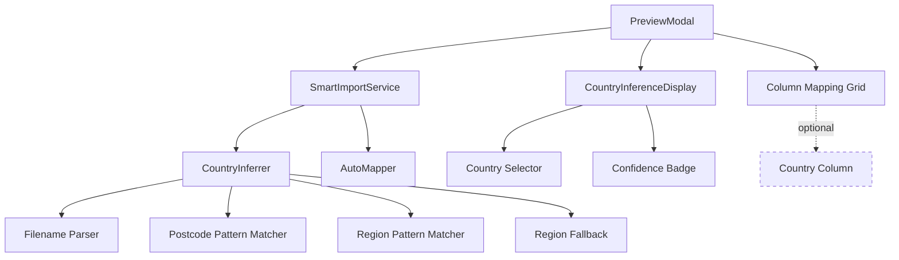

# Design Document

## Overview

This design integrates the existing country inference logic from the Smart Store Importer v1 into the upload modal UI. The solution makes the country field optional when it can be reliably detected from data patterns, while maintaining backward compatibility with spreadsheets that include country columns. The design focuses on minimal UI changes and leverages existing infrastructure.

## Architecture

### Component Integration



### Data Flow

1. **File Upload** → `UploadStoreData` receives file
2. **Parse & Analyze** → Backend parses file, returns headers and sample rows
3. **Auto-Map** → `AutoMapper` suggests field mappings
4. **Infer Country** → `CountryInferrer` analyzes filename and data patterns
5. **Display Results** → `PreviewModal` shows mappings + inferred country
6. **User Review** → User can accept, modify, or override country
7. **Import** → Inferred country applied to all rows during import

## Components and Interfaces

### Frontend Components

#### Enhanced PreviewModal (`apps/admin/app/stores/components/PreviewModal.tsx`)

**Changes Required:**
1. Add country inference state and display
2. Make country column mapping optional based on inference confidence
3. Integrate `CountryInferenceDisplay` component
4. Pass inferred country to import handler

```typescript
interface PreviewModalProps {
  isOpen: boolean;
  detectedHeaders: string[];
  sampleRows: ParsedRow[];
  suggestedMapping: Record<string, string>;
  totalRows: number;
  filename: string; // NEW: needed for country inference
  onClose: () => void;
  onImport: (mapping: Record<string, string>, country: string) => Promise<void>; // NEW: country param
}

interface PreviewModalState {
  columnMapping: Record<string, string>;
  countryInference: CountryInference | null; // NEW
  manualCountryOverride: string | null; // NEW
  isImporting: boolean;
  progress: ProgressUpdate;
}
```

**Key Logic Changes:**
```typescript
// On modal open, run country inference
useEffect(() => {
  if (isOpen && !countryInference) {
    const inference = countryInferrer.inferCountry(
      filename,
      sampleRows.map(r => Object.values(r.data)),
      getUserRegion() // from user context or browser
    );
    setCountryInference(inference);
  }
}, [isOpen, filename, sampleRows]);

// Validation logic update
const validateRequiredFields = () => {
  const requiredFields = ['name', 'address', 'city'];
  
  // Country is only required if confidence is low AND no column mapped
  if (
    (!countryInference || countryInference.confidence === 'low') &&
    !columnMapping['country'] &&
    !manualCountryOverride
  ) {
    requiredFields.push('country');
  }
  
  return requiredFields.filter(field => !columnMapping[field]);
};

// Import handler update
const handleImport = async () => {
  const finalCountry = manualCountryOverride 
    || countryInference?.country 
    || columnMapping['country'];
    
  await onImport(columnMapping, finalCountry);
};
```

#### New Component: CountryInferenceDisplay

```typescript
interface CountryInferenceDisplayProps {
  inference: CountryInference | null;
  manualOverride: string | null;
  onCountryChange: (country: string) => void;
  disabled?: boolean;
}

export function CountryInferenceDisplay({
  inference,
  manualOverride,
  onCountryChange,
  disabled = false
}: CountryInferenceDisplayProps) {
  const displayCountry = manualOverride || inference?.country || 'DE';
  const isManual = !!manualOverride;
  
  return (
    <div className="country-inference-section">
      <label className="section-label">
        Country
        {!isManual && inference?.confidence === 'low' && (
          <span className="required">*</span>
        )}
      </label>
      
      <div className="country-display">
        <select
          value={displayCountry}
          onChange={(e) => onCountryChange(e.target.value)}
          className="country-select"
          disabled={disabled}
        >
          {Object.entries(COUNTRY_INFO).map(([code, info]) => (
            <option key={code} value={code}>
              {info.flag} {info.name}
            </option>
          ))}
        </select>
        
        {!isManual && inference && (
          <div className="inference-info">
            <ConfidenceBadge 
              confidence={inference.confidence}
              tooltip={inference.displayText}
            />
            <span className="detection-method">
              {getMethodLabel(inference.method)}
            </span>
          </div>
        )}
        
        {isManual && (
          <span className="manual-indicator">
            ✏️ Manual selection
          </span>
        )}
      </div>
      
      {inference && inference.confidence !== 'high' && (
        <p className="inference-hint">
          {inference.displayText}
        </p>
      )}
    </div>
  );
}
```

#### New Component: ConfidenceBadge

```typescript
interface ConfidenceBadgeProps {
  confidence: 'high' | 'medium' | 'low';
  tooltip?: string;
}

export function ConfidenceBadge({ confidence, tooltip }: ConfidenceBadgeProps) {
  const config = {
    high: { emoji: '🟢', label: 'High', color: '#28a745' },
    medium: { emoji: '🟡', label: 'Medium', color: '#ffc107' },
    low: { emoji: '🔴', label: 'Low', color: '#dc3545' }
  };
  
  const { emoji, label, color } = config[confidence];
  
  return (
    <span 
      className="confidence-badge"
      style={{ color }}
      title={tooltip}
    >
      {emoji} {label}
    </span>
  );
}
```

### Backend Components

#### Enhanced Upload API (`apps/bff/routes/stores/upload.ts`)

**Changes Required:**
1. Pass filename to response for country inference
2. Include sample rows in response (already exists)

```typescript
@Post('/stores/upload')
async uploadStoreData(@UploadedFile() file: Express.Multer.File) {
  const parseResult = await this.fileParser.parse(file);
  const suggestedMapping = this.autoMapper.generateMappings(
    parseResult.headers,
    parseResult.rows.slice(0, 10)
  );
  
  return {
    success: true,
    data: {
      filename: file.originalname, // NEW: include filename
      headers: parseResult.headers,
      sampleRows: parseResult.rows.slice(0, 10),
      totalRows: parseResult.rows.length,
      suggestedMapping: suggestedMapping.mappings
    }
  };
}
```

#### Enhanced Ingest API (`apps/bff/routes/stores/ingest.ts`)

**Changes Required:**
1. Accept country parameter
2. Apply country to all rows if not present in data

```typescript
interface IngestRequest {
  mapping: Record<string, string>;
  rows: any[][];
  country?: string; // NEW: inferred or manual country
}

@Post('/stores/ingest')
async ingestStoreData(@Body() request: IngestRequest) {
  const { mapping, rows, country } = request;
  
  const normalizedStores = rows.map(row => {
    const store = this.normalizeRow(row, mapping);
    
    // Apply inferred country if not in data
    if (!store.country && country) {
      store.country = country;
    }
    
    return store;
  });
  
  // Continue with existing geocoding and upsert logic
  const result = await this.storeService.upsertStores(normalizedStores);
  
  return {
    success: true,
    data: result
  };
}
```

### Existing Components (No Changes)

These components already exist and work correctly:
- `CountryInferrer` (`apps/admin/lib/import/countryInference.ts`)
- `AutoMapper` (`apps/admin/lib/import/autoMap.ts`)
- `SmartImportService` (`apps/admin/lib/import/index.ts`)

## Data Models

### Country Inference Result

```typescript
interface CountryInference {
  country: CountryCode; // 'DE' | 'US' | 'UK' | 'FR' | 'CA' | 'AU' | 'NL' | 'IT' | 'ES' | 'CH'
  confidence: 'high' | 'medium' | 'low';
  method: 'column' | 'filename' | 'format' | 'fallback';
  displayText: string; // e.g., "Detected: Germany 🇩🇪 (from postcodes)"
  countryCode: string;
  flagEmoji: string;
}
```

### Enhanced Import Request

```typescript
interface ImportRequest {
  mapping: Record<string, string>;
  rows: any[][];
  country?: string; // NEW: optional inferred country
  filename?: string; // NEW: for telemetry
}
```

## Error Handling

### Country Inference Errors

```typescript
class CountryInferenceError extends Error {
  constructor(
    message: string,
    public context: {
      filename?: string;
      sampleRowCount?: number;
      method?: string;
    }
  ) {
    super(message);
    this.name = 'CountryInferenceError';
  }
}

// Error handling in CountryInferrer
try {
  const inference = this.inferFromDataPatterns(sampleRows);
  return inference;
} catch (error) {
  ErrorHandler.logError(error, { 
    context: 'inferFromDataPatterns',
    sampleRowCount: sampleRows.length 
  });
  // Return safe fallback instead of throwing
  return this.getFallbackInference();
}
```

### Validation Errors

```typescript
// In PreviewModal validation
const validateCountryRequirement = (): string | null => {
  const hasInferredCountry = countryInference && 
    countryInference.confidence !== 'low';
  const hasColumnMapping = !!columnMapping['country'];
  const hasManualOverride = !!manualCountryOverride;
  
  if (!hasInferredCountry && !hasColumnMapping && !hasManualOverride) {
    return 'Country is required. Please map a country column or select a country manually.';
  }
  
  return null;
};
```

## Testing Strategy

### Unit Tests

#### CountryInferrer Tests
```typescript
describe('CountryInferrer', () => {
  describe('inferFromFilename', () => {
    it('should detect Germany from filename', () => {
      const result = inferrer.inferFromFilename('germany_stores.xlsx');
      expect(result?.country).toBe('DE');
      expect(result?.confidence).toBe('high');
    });
    
    it('should detect UK from city names in filename', () => {
      const result = inferrer.inferFromFilename('london_locations.csv');
      expect(result?.country).toBe('UK');
    });
  });
  
  describe('inferFromDataPatterns', () => {
    it('should detect Germany from postcodes', () => {
      const sampleRows = [
        ['Store 1', 'Berlin', '10115'],
        ['Store 2', 'Munich', '80331']
      ];
      const result = inferrer.inferFromDataPatterns(sampleRows);
      expect(result?.country).toBe('DE');
      expect(result?.method).toBe('format');
    });
    
    it('should detect US from zip codes', () => {
      const sampleRows = [
        ['Store 1', 'New York', '10001'],
        ['Store 2', 'Los Angeles', '90001']
      ];
      const result = inferrer.inferFromDataPatterns(sampleRows);
      expect(result?.country).toBe('US');
    });
  });
});
```

#### PreviewModal Tests
```typescript
describe('PreviewModal with Country Inference', () => {
  it('should display inferred country with high confidence', () => {
    render(
      <PreviewModal
        filename="germany_stores.xlsx"
        detectedHeaders={['name', 'city', 'postcode']}
        sampleRows={germanSampleRows}
        {...otherProps}
      />
    );
    
    expect(screen.getByText(/Germany 🇩🇪/)).toBeInTheDocument();
    expect(screen.getByText(/🟢 High/)).toBeInTheDocument();
  });
  
  it('should allow manual country override', () => {
    const { getByRole } = render(<PreviewModal {...props} />);
    const countrySelect = getByRole('combobox', { name: /country/i });
    
    fireEvent.change(countrySelect, { target: { value: 'FR' } });
    
    expect(screen.getByText(/✏️ Manual selection/)).toBeInTheDocument();
  });
  
  it('should require country when confidence is low', () => {
    const { getByText } = render(
      <PreviewModal
        filename="stores.xlsx"
        detectedHeaders={['name', 'address']}
        sampleRows={ambiguousSampleRows}
        {...otherProps}
      />
    );
    
    fireEvent.click(getByText('Import & Geocode'));
    
    expect(screen.getByText(/country is required/i)).toBeInTheDocument();
  });
});
```

### Integration Tests

```typescript
describe('Country Inference Integration', () => {
  it('should complete import with inferred country', async () => {
    // Upload file
    const file = new File([germanStoresCSV], 'germany.csv');
    await uploadFile(file);
    
    // Verify country inference
    expect(screen.getByText(/Germany 🇩🇪/)).toBeInTheDocument();
    
    // Start import
    await clickImportButton();
    
    // Verify stores have correct country
    const stores = await fetchStores();
    expect(stores.every(s => s.country === 'DE')).toBe(true);
  });
  
  it('should handle manual country override', async () => {
    await uploadFile(ambiguousFile);
    
    // Change country manually
    await selectCountry('FR');
    await clickImportButton();
    
    // Verify override was applied
    const stores = await fetchStores();
    expect(stores.every(s => s.country === 'FR')).toBe(true);
  });
});
```

## Performance Considerations

### Frontend Performance

1. **Lazy Country Inference**: Only run inference when modal opens
2. **Memoized Results**: Cache inference result for modal session
3. **Debounced Manual Changes**: 300ms debounce on country selector

```typescript
// Memoize country inference
const countryInference = useMemo(() => {
  if (!isOpen || !filename) return null;
  
  return countryInferrer.inferCountry(
    filename,
    sampleRows.map(r => Object.values(r.data)),
    userRegion
  );
}, [isOpen, filename, sampleRows, userRegion]);
```

### Backend Performance

1. **No Additional API Calls**: Country inference runs client-side
2. **Minimal Data Transfer**: Only filename and sample rows needed
3. **No Database Impact**: Country applied during existing upsert operation

## UI/UX Design

### Country Inference Section Layout

```
┌─────────────────────────────────────────────────────┐
│ Country                                              │
│ ┌─────────────────────────────────────────────────┐ │
│ │ 🇩🇪 Germany                          ▼          │ │
│ └─────────────────────────────────────────────────┘ │
│ 🟢 High confidence · Detected from postcodes        │
│                                                      │
│ Found 15 German postcodes: 10115, 80331, 60311...  │
└─────────────────────────────────────────────────────┘
```

### Confidence Badge Colors

- **High (🟢)**: Green (#28a745) - Proceed with confidence
- **Medium (🟡)**: Yellow (#ffc107) - Review recommended
- **Low (🔴)**: Red (#dc3545) - Manual selection required

### Detection Method Labels

```typescript
const METHOD_LABELS = {
  column: 'from country column',
  filename: 'from filename',
  format: 'from postcodes',
  fallback: 'default selection'
};
```

## Migration Strategy

### Phase 1: Add Country Inference Display (Non-Breaking)
1. Add `CountryInferenceDisplay` component
2. Run inference in background but don't change validation
3. Display inference as informational only
4. Country column still required

### Phase 2: Make Country Optional (Breaking Change)
1. Update validation logic to make country optional with high confidence
2. Update import handler to accept country parameter
3. Update backend to apply inferred country
4. Add telemetry for monitoring

### Phase 3: Optimize and Enhance
1. Add expandable evidence details
2. Improve confidence scoring algorithm
3. Add more country patterns and city names
4. Implement caching for repeated filenames

## Rollback Plan

If issues arise:
1. **Immediate**: Set feature flag `COUNTRY_INFERENCE_ENABLED=false`
2. **Validation**: Revert to requiring country column mapping
3. **UI**: Hide country inference display
4. **Backend**: Ignore country parameter in ingest API

## Monitoring and Telemetry

### Key Metrics

```typescript
// Track country inference accuracy
telemetry.emit('country_inference_result', {
  method: inference.method,
  confidence: inference.confidence,
  country: inference.country,
  filename: sanitizeFilename(filename),
  hadCountryColumn: !!columnMapping['country'],
  wasOverridden: !!manualCountryOverride
});

// Track validation failures
telemetry.emit('country_validation_failed', {
  reason: 'low_confidence_no_column',
  filename: sanitizeFilename(filename)
});

// Track import success with inferred country
telemetry.emit('import_with_inferred_country', {
  country: finalCountry,
  rowCount: rows.length,
  inferenceConfidence: inference?.confidence
});
```

### Success Criteria

- 80%+ of imports with high confidence country inference
- <5% manual country overrides
- No increase in import failure rate
- No performance degradation in modal load time
