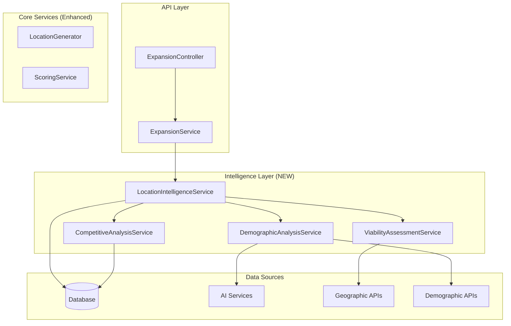

# Design Document

## Overview

The expansion location intelligence improvement enhances the existing expansion system by adding intelligent location targeting, comprehensive demographic analysis, and strategic reasoning capabilities. The design maintains backward compatibility while introducing new intelligence layers that transform algorithmic suggestions into executive-ready recommendations.

## Architecture

### Current System Analysis

The existing expansion system consists of:
- **ExpansionController**: REST API endpoints for recommendations and recomputation
- **ExpansionService**: Core business logic for location scoring and filtering
- **LocationGenerator**: Sophisticated multi-stage pipeline for location generation
- **Database Layer**: TradeArea entities with scoring and caching mechanisms

### Enhanced Architecture



## Components and Interfaces

### 1. LocationIntelligenceService

**Purpose**: Orchestrates intelligent location analysis and enhancement

```typescript
interface LocationIntelligenceService {
  enhanceLocationSuggestions(
    suggestions: ExpansionSuggestion[], 
    scope: ScopeSelection
  ): Promise<EnhancedSuggestion[]>;
  
  validateLocationViability(
    lat: number, 
    lng: number, 
    scope: ScopeSelection
  ): Promise<ViabilityAssessment>;
  
  identifyAlternativeLocations(
    originalSuggestion: ExpansionSuggestion,
    radius: number
  ): Promise<AlternativeLocation[]>;
}
```

**Key Responsibilities**:
- Coordinate intelligence enhancement across all suggestions
- Validate location viability against real-world factors
- Identify better alternatives when suggestions appear suboptimal
- Ensure suggestions target commercial areas rather than remote coordinates

### 2. DemographicAnalysisService

**Purpose**: Provides comprehensive demographic insights and AI-powered analysis

```typescript
interface DemographicAnalysisService {
  analyzeDemographics(
    lat: number, 
    lng: number, 
    radius: number
  ): Promise<DemographicProfile>;
  
  inferDemographicsWithAI(
    location: LocationContext,
    regionalPatterns: RegionalDemographics
  ): Promise<InferredDemographics>;
  
  assessMarketFit(
    demographics: DemographicProfile,
    targetProfile: CustomerProfile
  ): Promise<MarketFitScore>;
}
```

**Key Responsibilities**:
- Integrate multiple demographic data sources
- Use AI to infer demographics when data is unavailable
- Assess market fit against Subway's target customer profile
- Provide detailed demographic breakdowns for executive review

### 3. CompetitiveAnalysisService

**Purpose**: Analyzes competitive landscape and market saturation

```typescript
interface CompetitiveAnalysisService {
  analyzeCompetitiveLandscape(
    lat: number, 
    lng: number, 
    analysisRadius: number
  ): Promise<CompetitiveAnalysis>;
  
  calculateCannibalizationRisk(
    newLocation: Location,
    existingStores: Store[]
  ): Promise<CannibalizationAssessment>;
  
  identifyMarketGaps(
    region: ScopeSelection,
    competitorData: CompetitorStore[]
  ): Promise<MarketGap[]>;
}
```

**Key Responsibilities**:
- Analyze existing store performance impact
- Calculate market saturation levels
- Identify underserved market opportunities
- Assess competitive positioning advantages

### 4. ViabilityAssessmentService

**Purpose**: Evaluates real-world location viability and commercial potential

```typescript
interface ViabilityAssessmentService {
  assessCommercialViability(
    lat: number, 
    lng: number
  ): Promise<CommercialViabilityScore>;
  
  validateLocationAccessibility(
    location: Location
  ): Promise<AccessibilityAssessment>;
  
  analyzeUrbanContext(
    lat: number, 
    lng: number, 
    radius: number
  ): Promise<UrbanContextAnalysis>;
  
  generateStrategicRationale(
    location: Location,
    analysis: LocationAnalysis
  ): Promise<StrategicRationale>;
}
```

**Key Responsibilities**:
- Validate locations are in developable commercial areas
- Assess proximity to town centers and commercial districts
- Analyze transportation accessibility and foot traffic potential
- Generate intelligent rationales explaining location selection

## Data Models

### Enhanced Suggestion Model

```typescript
interface EnhancedSuggestion extends ExpansionSuggestion {
  // Intelligence enhancements
  locationIntelligence: LocationIntelligence;
  demographicProfile: DemographicProfile;
  competitiveAnalysis: CompetitiveAnalysis;
  viabilityAssessment: ViabilityAssessment;
  strategicRationale: StrategicRationale;
  
  // Quality indicators
  intelligenceScore: number; // 0-1 overall intelligence confidence
  credibilityRating: 'HIGH' | 'MEDIUM' | 'LOW';
  executiveReadiness: boolean;
}

interface LocationIntelligence {
  isCommercialArea: boolean;
  distanceToTownCenter: number; // meters
  nearbyCommercialFeatures: CommercialFeature[];
  landUseType: 'commercial' | 'mixed' | 'residential' | 'industrial';
  developmentPotential: number; // 0-1 score
}

interface DemographicProfile {
  population: PopulationMetrics;
  ageDistribution: AgeDistribution;
  incomeDistribution: IncomeDistribution;
  lifestyleSegments: LifestyleSegment[];
  consumerBehavior: ConsumerBehaviorProfile;
  marketFitScore: number; // 0-1 alignment with Subway target
  dataSource: 'census' | 'commercial' | 'ai_inferred';
  confidence: number; // 0-1 data confidence
}

interface CompetitiveAnalysis {
  nearbyCompetitors: CompetitorStore[];
  marketSaturation: number; // 0-1 saturation level
  cannibalizationRisk: CannibalizationRisk;
  competitiveAdvantages: string[];
  marketGapOpportunity: number; // 0-1 opportunity score
}

interface StrategicRationale {
  primaryReasons: string[];
  addressedConcerns: string[];
  alternativeComparison?: AlternativeComparison;
  confidenceFactors: string[];
  riskMitigations: string[];
}
```

### Configuration Models

```typescript
interface IntelligenceConfig {
  enableDemographicInference: boolean;
  enableCompetitiveAnalysis: boolean;
  enableViabilityAssessment: boolean;
  enableStrategicRationale: boolean;
  
  // Thresholds
  minCommercialViabilityScore: number;
  maxDistanceToTownCenter: number; // meters
  minMarketFitScore: number;
  
  // AI Configuration
  aiProvider: 'openai' | 'anthropic';
  demographicInferenceModel: string;
  rationaleGenerationModel: string;
}
```

## Error Handling

### Graceful Degradation Strategy

1. **Intelligence Service Failures**: Fall back to original algorithmic suggestions with warning flags
2. **Demographic Data Unavailable**: Use AI inference with confidence indicators
3. **Geographic API Failures**: Use cached data or simplified analysis
4. **AI Service Timeouts**: Return suggestions with reduced intelligence scores

### Error Response Format

```typescript
interface IntelligenceError {
  code: string;
  message: string;
  fallbackApplied: boolean;
  impactedFeatures: string[];
  retryable: boolean;
}
```

## Testing Strategy

### Unit Testing
- **Service Layer**: Mock external dependencies, test core logic
- **Intelligence Services**: Test individual analysis components
- **Data Transformation**: Verify model mapping and validation

### Integration Testing
- **API Endpoints**: Test enhanced responses maintain backward compatibility
- **Database Operations**: Verify caching and persistence of intelligence data
- **External Services**: Test AI and geographic API integrations

### Performance Testing
- **Intelligence Enhancement**: Measure latency impact of new analysis layers
- **Caching Effectiveness**: Validate cache hit rates for intelligence data
- **Concurrent Requests**: Test system behavior under load

### Acceptance Testing
- **Executive Dashboard**: Verify enhanced suggestions display correctly
- **Rationale Quality**: Validate AI-generated explanations are coherent
- **Demographic Accuracy**: Compare inferred vs. actual demographic data

## Implementation Phases

### Phase 1: Foundation (Backward Compatible)
- Implement LocationIntelligenceService interface
- Add intelligence enhancement to existing endpoints
- Maintain all existing response formats
- Add optional intelligence fields to responses

### Phase 2: Core Intelligence Services
- Implement DemographicAnalysisService with AI inference
- Implement ViabilityAssessmentService with geographic validation
- Add caching layer for intelligence data
- Implement graceful degradation patterns

### Phase 3: Advanced Analysis
- Implement CompetitiveAnalysisService
- Add strategic rationale generation
- Implement alternative location identification
- Add executive readiness scoring

### Phase 4: Optimization and Monitoring
- Performance optimization and caching improvements
- Add telemetry for intelligence service usage
- Implement A/B testing for intelligence features
- Add monitoring dashboards for service health

## Security and Privacy Considerations

- **Data Privacy**: Ensure demographic data handling complies with privacy regulations
- **API Security**: Secure external API keys and rate limiting
- **Data Retention**: Implement appropriate retention policies for cached intelligence data
- **Access Control**: Maintain existing authorization patterns for enhanced endpoints