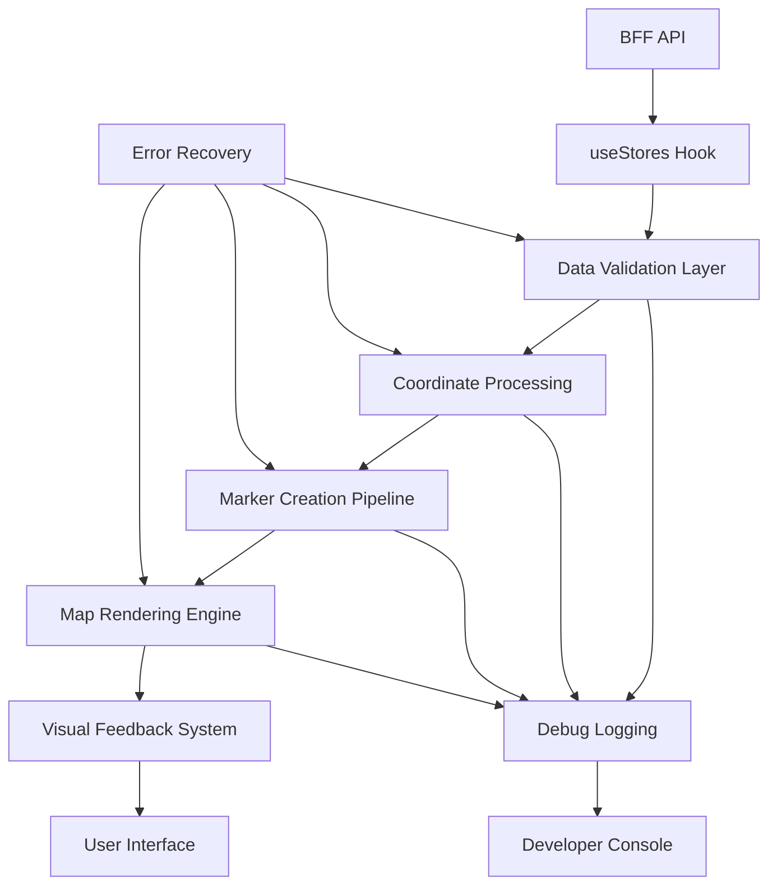

# Design Document

## Overview

The Living Map data display issue stems from a disconnect between successful API data fetching and the actual rendering of store markers on the map. While the BFF API is correctly returning store data with coordinates, and the useStores hook is fetching this data, there appears to be a gap in the data flow that prevents the markers from appearing on the map. This design addresses the specific issues in the data pipeline and ensures reliable store visualization.

## Architecture

### Current Data Flow Analysis

The current system has these components working correctly:
1. **BFF API** - Returns store data with latitude/longitude coordinates ✅
2. **useStores Hook** - Fetches data from BFF API ✅  
3. **MapView Component** - Initializes map successfully ✅

The issue appears to be in the connection between the fetched store data and the marker rendering process.

### Root Cause Analysis

Based on the code review, potential issues include:

1. **Data Processing Gap**: Store data may be fetched but not properly processed for map rendering
2. **Coordinate Validation**: Invalid or missing coordinate validation may prevent marker creation
3. **Rendering Pipeline**: The marker creation and map addition process may have silent failures
4. **State Management**: React state updates may not be triggering map re-renders properly
5. **Error Suppression**: Errors in the rendering pipeline may be caught and suppressed without proper logging

### Proposed Solution Architecture



## Components and Interfaces

### Enhanced Data Validation Layer

```typescript
interface StoreDataValidator {
  validateStoreData(stores: any[]): {
    valid: StoreWithActivity[];
    invalid: Array<{ store: any; reason: string }>;
    summary: ValidationSummary;
  };
  
  validateCoordinates(lat: number, lng: number): {
    isValid: boolean;
    reason?: string;
  };
  
  logValidationResults(results: ValidationResults): void;
}

interface ValidationSummary {
  totalStores: number;
  validStores: number;
  invalidStores: number;
  coordinateIssues: number;
  dataIssues: number;
}

class RobustStoreValidator implements StoreDataValidator {
  validateStoreData(stores: any[]): ValidationResults {
    const valid: StoreWithActivity[] = [];
    const invalid: Array<{ store: any; reason: string }> = [];
    
    stores.forEach(store => {
      // Check required fields
      if (!store.id || !store.name) {
        invalid.push({ store, reason: 'Missing required fields (id, name)' });
        return;
      }
      
      // Validate coordinates
      const coordValidation = this.validateCoordinates(store.latitude, store.longitude);
      if (!coordValidation.isValid) {
        invalid.push({ store, reason: `Invalid coordinates: ${coordValidation.reason}` });
        return;
      }
      
      // Store is valid
      valid.push(store as StoreWithActivity);
    });
    
    const summary: ValidationSummary = {
      totalStores: stores.length,
      validStores: valid.length,
      invalidStores: invalid.length,
      coordinateIssues: invalid.filter(i => i.reason.includes('coordinates')).length,
      dataIssues: invalid.filter(i => i.reason.includes('fields')).length,
    };
    
    return { valid, invalid, summary };
  }
  
  validateCoordinates(lat: number, lng: number): { isValid: boolean; reason?: string } {
    if (typeof lat !== 'number' || typeof lng !== 'number') {
      return { isValid: false, reason: 'Coordinates must be numbers' };
    }
    
    if (isNaN(lat) || isNaN(lng)) {
      return { isValid: false, reason: 'Coordinates cannot be NaN' };
    }
    
    if (lat < -90 || lat > 90) {
      return { isValid: false, reason: `Latitude ${lat} out of range (-90 to 90)` };
    }
    
    if (lng < -180 || lng > 180) {
      return { isValid: false, reason: `Longitude ${lng} out of range (-180 to 180)` };
    }
    
    return { isValid: true };
  }
  
  logValidationResults(results: ValidationResults): void {
    console.log('🔍 Store Data Validation Results:', {
      total: results.summary.totalStores,
      valid: results.summary.validStores,
      invalid: results.summary.invalidStores,
      coordinateIssues: results.summary.coordinateIssues,
      dataIssues: results.summary.dataIssues
    });
    
    if (results.invalid.length > 0) {
      console.warn('❌ Invalid stores found:', results.invalid);
    }
    
    if (results.valid.length > 0) {
      console.log('✅ Sample valid stores:', results.valid.slice(0, 3).map(s => ({
        id: s.id,
        name: s.name,
        lat: s.latitude,
        lng: s.longitude
      })));
    }
  }
}
```

### Enhanced Marker Creation Pipeline

```typescript
interface MarkerCreationPipeline {
  createMarkersFromStores(stores: StoreWithActivity[]): Promise<MarkerCreationResult>;
  addMarkersToMap(markers: MapMarker[], map: MapLibreMap): Promise<void>;
  clearExistingMarkers(): void;
  getMarkerStats(): MarkerStats;
}

interface MarkerCreationResult {
  markers: MapMarker[];
  errors: Array<{ store: StoreWithActivity; error: string }>;
  stats: MarkerStats;
}

interface MarkerStats {
  totalStores: number;
  markersCreated: number;
  markersAdded: number;
  creationErrors: number;
  additionErrors: number;
}

class RobustMarkerPipeline implements MarkerCreationPipeline {
  private currentMarkers: Map<string, Marker> = new Map();
  
  async createMarkersFromStores(stores: StoreWithActivity[]): Promise<MarkerCreationResult> {
    const markers: MapMarker[] = [];
    const errors: Array<{ store: StoreWithActivity; error: string }> = [];
    
    console.log(`🎯 Creating markers for ${stores.length} stores...`);
    
    for (const store of stores) {
      try {
        const markerElement = this.createMarkerElement(store);
        const marker = new Marker(markerElement)
          .setLngLat([store.longitude, store.latitude]);
        
        markers.push({
          id: store.id,
          marker,
          store,
          element: markerElement
        });
        
      } catch (error) {
        const errorMessage = error instanceof Error ? error.message : 'Unknown error';
        errors.push({ store, error: errorMessage });
        console.error(`❌ Failed to create marker for store ${store.id}:`, error);
      }
    }
    
    const stats: MarkerStats = {
      totalStores: stores.length,
      markersCreated: markers.length,
      markersAdded: 0, // Will be updated when added to map
      creationErrors: errors.length,
      additionErrors: 0
    };
    
    console.log('📊 Marker creation stats:', stats);
    
    return { markers, errors, stats };
  }
  
  async addMarkersToMap(markers: MapMarker[], map: MapLibreMap): Promise<void> {
    console.log(`🗺️ Adding ${markers.length} markers to map...`);
    
    let addedCount = 0;
    let errorCount = 0;
    
    for (const mapMarker of markers) {
      try {
        mapMarker.marker.addTo(map);
        this.currentMarkers.set(mapMarker.id, mapMarker.marker);
        addedCount++;
      } catch (error) {
        errorCount++;
        console.error(`❌ Failed to add marker ${mapMarker.id} to map:`, error);
      }
    }
    
    console.log(`✅ Successfully added ${addedCount}/${markers.length} markers to map`);
    
    if (errorCount > 0) {
      console.warn(`⚠️ ${errorCount} markers failed to be added to map`);
    }
  }
  
  clearExistingMarkers(): void {
    console.log(`🧹 Clearing ${this.currentMarkers.size} existing markers...`);
    
    this.currentMarkers.forEach(marker => {
      try {
        marker.remove();
      } catch (error) {
        console.warn('Error removing marker:', error);
      }
    });
    
    this.currentMarkers.clear();
    console.log('✅ All markers cleared');
  }
  
  private createMarkerElement(store: StoreWithActivity): HTMLElement {
    const el = document.createElement('div');
    el.className = 'store-marker';
    el.style.cssText = `
      width: 16px;
      height: 16px;
      background-color: ${store.recentActivity ? '#22c55e' : '#3b82f6'};
      border: 2px solid white;
      border-radius: 50%;
      cursor: pointer;
      box-shadow: 0 2px 4px rgba(0,0,0,0.2);
      transition: transform 0.2s ease;
    `;
    
    if (store.recentActivity) {
      el.style.animation = 'pulse 2s infinite';
    }
    
    // Add accessibility attributes
    el.setAttribute('role', 'button');
    el.setAttribute('tabindex', '0');
    el.setAttribute('aria-label', `${store.name} store in ${store.country}`);
    el.setAttribute('title', `${store.name}\n${store.country}${store.recentActivity ? '\n🟢 Recent activity' : ''}`);
    
    return el;
  }
  
  getMarkerStats(): MarkerStats {
    return {
      totalStores: 0, // Will be set during creation
      markersCreated: 0,
      markersAdded: this.currentMarkers.size,
      creationErrors: 0,
      additionErrors: 0
    };
  }
}
```

### Enhanced Debug and Monitoring System

```typescript
interface DataFlowMonitor {
  trackAPICall(endpoint: string, response: any): void;
  trackDataProcessing(stage: string, data: any): void;
  trackMarkerRendering(stats: MarkerStats): void;
  trackMapState(map: MapLibreMap): void;
  generateDebugReport(): DebugReport;
}

interface DebugReport {
  timestamp: string;
  apiCalls: APICallLog[];
  dataProcessing: ProcessingLog[];
  markerRendering: RenderingLog[];
  mapState: MapStateLog;
  issues: Issue[];
  recommendations: string[];
}

class ComprehensiveDataFlowMonitor implements DataFlowMonitor {
  private logs: {
    apiCalls: APICallLog[];
    dataProcessing: ProcessingLog[];
    markerRendering: RenderingLog[];
    mapState: MapStateLog[];
  } = {
    apiCalls: [],
    dataProcessing: [],
    markerRendering: [],
    mapState: []
  };
  
  trackAPICall(endpoint: string, response: any): void {
    const log: APICallLog = {
      timestamp: new Date().toISOString(),
      endpoint,
      success: !!response.success,
      dataLength: response.data?.length || 0,
      error: response.error || null
    };
    
    this.logs.apiCalls.push(log);
    
    console.log('📡 API Call:', {
      endpoint,
      success: log.success,
      dataLength: log.dataLength,
      error: log.error
    });
  }
  
  trackDataProcessing(stage: string, data: any): void {
    const log: ProcessingLog = {
      timestamp: new Date().toISOString(),
      stage,
      inputCount: Array.isArray(data) ? data.length : 1,
      outputCount: data.valid?.length || (Array.isArray(data) ? data.length : 1),
      errors: data.invalid?.length || 0
    };
    
    this.logs.dataProcessing.push(log);
    
    console.log(`🔄 Data Processing [${stage}]:`, {
      input: log.inputCount,
      output: log.outputCount,
      errors: log.errors
    });
  }
  
  trackMarkerRendering(stats: MarkerStats): void {
    const log: RenderingLog = {
      timestamp: new Date().toISOString(),
      stats
    };
    
    this.logs.markerRendering.push(log);
    
    console.log('🎯 Marker Rendering:', stats);
  }
  
  trackMapState(map: MapLibreMap): void {
    const center = map.getCenter();
    const zoom = map.getZoom();
    
    const log: MapStateLog = {
      timestamp: new Date().toISOString(),
      center: { lat: center.lat, lng: center.lng },
      zoom,
      loaded: map.loaded(),
      style: map.getStyle()?.name || 'unknown'
    };
    
    this.logs.mapState.push(log);
    
    console.log('🗺️ Map State:', {
      center: `${center.lat.toFixed(4)}, ${center.lng.toFixed(4)}`,
      zoom: zoom.toFixed(2),
      loaded: log.loaded
    });
  }
  
  generateDebugReport(): DebugReport {
    const issues: Issue[] = [];
    const recommendations: string[] = [];
    
    // Analyze for issues
    const latestAPICall = this.logs.apiCalls[this.logs.apiCalls.length - 1];
    if (!latestAPICall?.success) {
      issues.push({
        type: 'api_failure',
        message: 'Latest API call failed',
        severity: 'high'
      });
      recommendations.push('Check BFF API connectivity and error logs');
    }
    
    const latestRendering = this.logs.markerRendering[this.logs.markerRendering.length - 1];
    if (latestRendering && latestRendering.stats.markersAdded === 0) {
      issues.push({
        type: 'no_markers',
        message: 'No markers were added to the map',
        severity: 'high'
      });
      recommendations.push('Check coordinate validation and marker creation process');
    }
    
    return {
      timestamp: new Date().toISOString(),
      apiCalls: this.logs.apiCalls,
      dataProcessing: this.logs.dataProcessing,
      markerRendering: this.logs.markerRendering,
      mapState: this.logs.mapState[this.logs.mapState.length - 1],
      issues,
      recommendations
    };
  }
}
```

## Data Models

### Enhanced Store Data Processing

```typescript
interface ProcessedStoreData {
  original: any;
  processed: StoreWithActivity;
  validation: {
    isValid: boolean;
    issues: string[];
    warnings: string[];
  };
  coordinates: {
    latitude: number;
    longitude: number;
    source: 'api' | 'generated' | 'fallback';
    validated: boolean;
  };
}

interface DataProcessingResult {
  stores: ProcessedStoreData[];
  summary: {
    total: number;
    valid: number;
    invalid: number;
    warnings: number;
  };
  errors: ProcessingError[];
}
```

### Enhanced Error Handling

```typescript
interface ProcessingError {
  type: 'validation' | 'coordinate' | 'rendering' | 'api';
  message: string;
  store?: any;
  recoverable: boolean;
  suggestion: string;
}

interface ErrorRecoveryStrategy {
  canRecover(error: ProcessingError): boolean;
  recover(error: ProcessingError): Promise<boolean>;
  getAlternatives(error: ProcessingError): string[];
}
```

## Error Handling

### Comprehensive Error Recovery

```typescript
class DataDisplayErrorHandler {
  async handleDataFlowError(error: Error, context: string): Promise<ErrorRecoveryResult> {
    console.error(`❌ Data flow error in ${context}:`, error);
    
    const recovery: ErrorRecoveryResult = {
      recovered: false,
      fallbackApplied: false,
      userAction: null,
      retryAvailable: true
    };
    
    switch (context) {
      case 'api_fetch':
        recovery.userAction = 'Check network connection and BFF API status';
        recovery.fallbackApplied = await this.applyMockDataFallback();
        break;
        
      case 'data_validation':
        recovery.userAction = 'Review store data format and coordinate values';
        recovery.recovered = await this.skipInvalidStores();
        break;
        
      case 'marker_creation':
        recovery.userAction = 'Check browser console for detailed marker errors';
        recovery.recovered = await this.retryMarkerCreation();
        break;
        
      case 'map_rendering':
        recovery.userAction = 'Try refreshing the page or switching to list view';
        recovery.fallbackApplied = await this.showListView();
        break;
    }
    
    return recovery;
  }
  
  private async applyMockDataFallback(): Promise<boolean> {
    // Implementation for mock data fallback
    return true;
  }
  
  private async skipInvalidStores(): Promise<boolean> {
    // Implementation for skipping invalid stores
    return true;
  }
  
  private async retryMarkerCreation(): Promise<boolean> {
    // Implementation for retrying marker creation
    return true;
  }
  
  private async showListView(): Promise<boolean> {
    // Implementation for fallback to list view
    return true;
  }
}
```

## Testing Strategy

### Data Flow Testing

1. **API Integration Tests**
   - Verify BFF API returns expected store data format
   - Test coordinate data presence and validity
   - Validate error handling for API failures

2. **Data Processing Tests**
   - Test store data validation with various input formats
   - Verify coordinate validation logic
   - Test error handling for invalid data

3. **Marker Rendering Tests**
   - Test marker creation with valid store data
   - Verify markers are added to map correctly
   - Test error handling for marker creation failures

4. **End-to-End Flow Tests**
   - Test complete data flow from API to map display
   - Verify stores appear on map after successful data fetch
   - Test error recovery and fallback scenarios

### Visual Validation

1. **Store Visibility Tests**
   - Verify stores appear at correct coordinates
   - Test marker styling and activity indicators
   - Validate clustering behavior with real data

2. **Debug Information Tests**
   - Verify debug logging provides useful information
   - Test error reporting and user feedback
   - Validate performance monitoring data

## Implementation Phases

### Phase 1: Enhanced Data Validation and Logging
- Implement comprehensive store data validation
- Add detailed logging throughout the data pipeline
- Create debug monitoring system
- Test with current API data

### Phase 2: Robust Marker Creation Pipeline
- Implement error-resistant marker creation
- Add comprehensive error handling and recovery
- Create fallback mechanisms for rendering failures
- Test marker display with validated data

### Phase 3: User Feedback and Recovery
- Implement clear user feedback for data issues
- Add retry mechanisms and error recovery
- Create fallback to list view when map fails
- Comprehensive testing and validation

This design ensures that store data flows reliably from the API to the map display, with comprehensive error handling and debugging capabilities to identify and resolve any issues in the data pipeline.