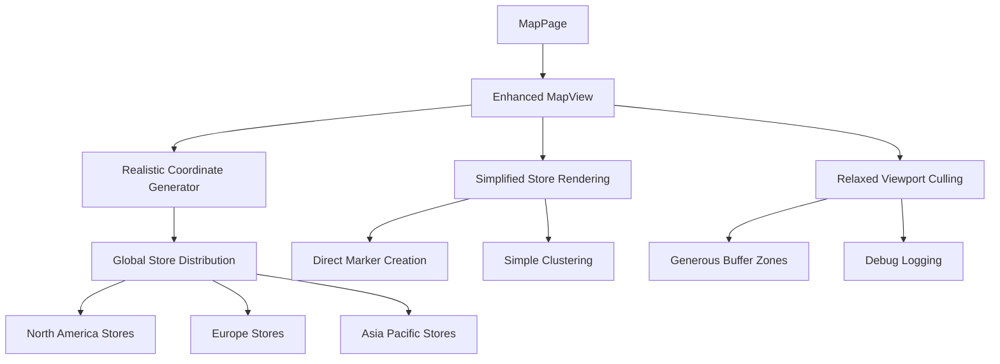

# Design Document

## Overview

The Living Map fixes address fundamental issues in store coordinate generation, viewport culling logic, and map initialization reliability. The current implementation generates stores in a tiny area around NYC and applies overly aggressive viewport culling, making most stores invisible. This design provides realistic global store distribution, simplified viewport management, and robust error handling to create a functional and demonstrable map interface.

## Architecture

### Current Issues Analysis

1. **Coordinate Generation Problem**: Stores are generated with tiny offsets (±0.1 degrees) around NYC, creating an invisible cluster
2. **Viewport Culling Too Aggressive**: The culling logic hides stores that should be visible
3. **Complex Initialization**: Multiple layers of error handling and performance monitoring create failure points
4. **Poor Mock Data**: Fallback data doesn't represent realistic business scenarios

### Proposed Solution Architecture



## Components and Interfaces

### Enhanced Coordinate Generation

**Current Implementation Issues:**
```typescript
// PROBLEM: Tiny offsets create invisible clustering
const latOffset = (Math.abs(hash) % 200 - 100) / 1000; // ±0.1 degrees
const lngOffset = (Math.abs(hash * 2) % 200 - 100) / 1000;
const latitude = 40.7128 + latOffset; // All around NYC
const longitude = -74.0060 + lngOffset;
```

**Proposed Solution:**
```typescript
interface GlobalStoreDistribution {
  regions: {
    name: string;
    centerLat: number;
    centerLng: number;
    radius: number; // degrees
    storeCount: number;
    cities: Array<{
      name: string;
      lat: number;
      lng: number;
      weight: number; // probability of store placement
    }>;
  }[];
}

const GLOBAL_DISTRIBUTION: GlobalStoreDistribution = {
  regions: [
    {
      name: 'North America',
      centerLat: 39.8283,
      centerLng: -98.5795,
      radius: 25,
      storeCount: 40,
      cities: [
        { name: 'New York', lat: 40.7128, lng: -74.0060, weight: 0.15 },
        { name: 'Los Angeles', lat: 34.0522, lng: -118.2437, weight: 0.12 },
        { name: 'Chicago', lat: 41.8781, lng: -87.6298, weight: 0.10 },
        { name: 'Toronto', lat: 43.6532, lng: -79.3832, weight: 0.08 },
        // ... more cities
      ]
    },
    {
      name: 'Europe',
      centerLat: 54.5260,
      centerLng: 15.2551,
      radius: 20,
      storeCount: 30,
      cities: [
        { name: 'London', lat: 51.5074, lng: -0.1278, weight: 0.15 },
        { name: 'Paris', lat: 48.8566, lng: 2.3522, weight: 0.12 },
        { name: 'Berlin', lat: 52.5200, lng: 13.4050, weight: 0.10 },
        // ... more cities
      ]
    },
    {
      name: 'Asia Pacific',
      centerLat: 35.6762,
      centerLng: 139.6503,
      radius: 30,
      storeCount: 30,
      cities: [
        { name: 'Tokyo', lat: 35.6762, lng: 139.6503, weight: 0.15 },
        { name: 'Sydney', lat: -33.8688, lng: 151.2093, weight: 0.12 },
        { name: 'Singapore', lat: 1.3521, lng: 103.8198, weight: 0.10 },
        // ... more cities
      ]
    }
  ]
};
```

### Simplified Viewport Culling

**Current Problem:**
- Complex ViewportCuller with aggressive filtering
- Spatial sampling that may hide important stores
- Multiple layers of culling logic

**Proposed Solution:**
```typescript
interface SimpleViewportCuller {
  cullStores(stores: StoreWithActivity[], bounds: MapBounds): StoreWithActivity[];
  getVisibleBounds(mapBounds: MapBounds, bufferPercent: number): MapBounds;
}

class RelaxedViewportCuller implements SimpleViewportCuller {
  private readonly BUFFER_PERCENT = 50; // 50% buffer around viewport
  private readonly MAX_STORES = 1000; // Much higher limit
  
  cullStores(stores: StoreWithActivity[], bounds: MapBounds): StoreWithActivity[] {
    const bufferedBounds = this.getVisibleBounds(bounds, this.BUFFER_PERCENT);
    
    const visibleStores = stores.filter(store => 
      this.isInBounds(store.latitude, store.longitude, bufferedBounds)
    );
    
    // Only apply additional culling if we have way too many stores
    if (visibleStores.length > this.MAX_STORES) {
      return this.prioritizedSample(visibleStores, this.MAX_STORES);
    }
    
    return visibleStores;
  }
  
  private prioritizedSample(stores: StoreWithActivity[], maxCount: number): StoreWithActivity[] {
    // Always include active stores first
    const activeStores = stores.filter(s => s.recentActivity);
    const inactiveStores = stores.filter(s => !s.recentActivity);
    
    if (activeStores.length >= maxCount) {
      return activeStores.slice(0, maxCount);
    }
    
    const remainingSlots = maxCount - activeStores.length;
    const selectedInactive = inactiveStores.slice(0, remainingSlots);
    
    return [...activeStores, ...selectedInactive];
  }
}
```

### Simplified Map Initialization

**Current Issues:**
- Complex error boundaries and performance monitoring
- Multiple timeout handlers and cleanup functions
- Memory monitoring that can cause crashes

**Proposed Solution:**
```typescript
interface SimpleMapRenderer {
  initialize(container: HTMLElement): Promise<void>;
  renderStores(stores: StoreWithActivity[]): void;
  updateViewport(viewport: MapViewport): void;
  cleanup(): void;
}

class RobustMapRenderer implements SimpleMapRenderer {
  private map: MapLibreMap | null = null;
  private markers: Map<string, Marker> = new Map();
  
  async initialize(container: HTMLElement): Promise<void> {
    try {
      // Simple, direct initialization
      this.map = new MapLibreMap({
        container,
        style: 'https://demotiles.maplibre.org/style.json',
        center: [0, 20], // Global center
        zoom: 2, // Global zoom level
      });
      
      await new Promise((resolve, reject) => {
        this.map!.on('load', resolve);
        this.map!.on('error', reject);
        
        // Simple timeout
        setTimeout(() => reject(new Error('Map load timeout')), 10000);
      });
      
      // Add basic controls
      this.map.addControl(new NavigationControl(), 'top-right');
      
    } catch (error) {
      throw new Error(`Failed to initialize map: ${error.message}`);
    }
  }
  
  renderStores(stores: StoreWithActivity[]): void {
    if (!this.map) return;
    
    // Clear existing markers
    this.clearMarkers();
    
    // Create new markers with simple, reliable approach
    stores.forEach(store => {
      const marker = this.createStoreMarker(store);
      marker.addTo(this.map!);
      this.markers.set(store.id, marker);
    });
  }
  
  private createStoreMarker(store: StoreWithActivity): Marker {
    const el = document.createElement('div');
    el.className = 'simple-store-marker';
    el.style.cssText = `
      width: 20px;
      height: 20px;
      background-color: ${store.recentActivity ? '#22c55e' : '#3b82f6'};
      border: 2px solid white;
      border-radius: 50%;
      cursor: pointer;
      box-shadow: 0 2px 4px rgba(0,0,0,0.2);
    `;
    
    if (store.recentActivity) {
      el.style.animation = 'pulse 2s infinite';
    }
    
    return new Marker(el).setLngLat([store.longitude, store.latitude]);
  }
}
```

## Data Models

### Enhanced Store Distribution

```typescript
interface RealisticStoreData {
  id: string;
  name: string;
  latitude: number;
  longitude: number;
  region: 'AMER' | 'EMEA' | 'APAC';
  country: string;
  city: string;
  recentActivity: boolean;
  generatedCoordinates: boolean; // Flag for mock coordinates
}

interface CoordinateGenerator {
  generateGlobalDistribution(storeCount: number): RealisticStoreData[];
  generateForRegion(region: string, count: number): RealisticStoreData[];
  assignToNearestCity(baseLat: number, baseLng: number): {
    city: string;
    country: string;
    adjustedLat: number;
    adjustedLng: number;
  };
}
```

### Simplified Error Handling

```typescript
interface MapError {
  type: 'initialization' | 'rendering' | 'data' | 'network';
  message: string;
  recoverable: boolean;
  retryAction?: () => void;
  fallbackAction?: () => void;
}

interface ErrorRecovery {
  canRetry: boolean;
  maxRetries: number;
  currentRetries: number;
  fallbackAvailable: boolean;
}
```

## Error Handling

### Simplified Error Strategy

1. **Initialization Errors**: Clear message with retry option
2. **Data Errors**: Automatic fallback to mock data
3. **Rendering Errors**: Graceful degradation with basic markers
4. **Network Errors**: Retry with exponential backoff

### Recovery Mechanisms

```typescript
class SimpleErrorHandler {
  handleMapError(error: Error, context: string): MapError {
    console.error(`Map error in ${context}:`, error);
    
    return {
      type: this.categorizeError(error),
      message: this.getUserFriendlyMessage(error),
      recoverable: this.isRecoverable(error),
      retryAction: () => this.retry(context),
      fallbackAction: () => this.fallback(context)
    };
  }
  
  private getUserFriendlyMessage(error: Error): string {
    if (error.message.includes('network')) {
      return 'Unable to load map data. Please check your connection.';
    }
    if (error.message.includes('timeout')) {
      return 'Map is taking too long to load. Please try again.';
    }
    return 'Map encountered an error. Please try refreshing the page.';
  }
}
```

## Testing Strategy

### Unit Tests
- Coordinate generation produces realistic global distribution
- Viewport culling with generous buffers
- Error handling and recovery mechanisms
- Mock data fallback functionality

### Integration Tests
- Complete map loading with realistic store distribution
- Viewport changes show appropriate stores
- Error scenarios trigger proper fallbacks
- Performance remains acceptable with global store distribution

### Visual Testing
- Stores appear in realistic global locations
- Activity indicators are clearly visible
- Clustering works at different zoom levels
- Error states provide clear user guidance

## Implementation Phases

### Phase 1: Fix Core Issues
- Replace coordinate generation with realistic global distribution
- Simplify viewport culling with generous buffers
- Add comprehensive debug logging
- Test with realistic store distribution

### Phase 2: Enhance Reliability
- Simplify map initialization process
- Improve error handling and recovery
- Add fallback mechanisms for all failure modes
- Validate performance with global distribution

### Phase 3: Polish and Optimize
- Fine-tune store distribution and activity indicators
- Optimize clustering for global scale
- Add user feedback and guidance
- Comprehensive testing and validation

This design ensures the Living Map will display stores in realistic global locations, handle errors gracefully, and provide a functional demonstration of the intended features.