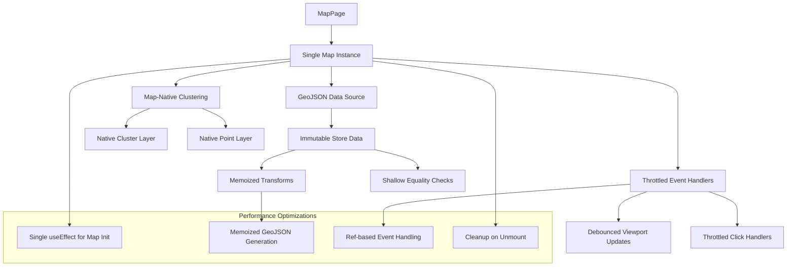

# Design Document

## Overview

The Living Map performance stabilization addresses critical issues with marker anchoring and CPU performance while preserving the current visual design. The core problems stem from using DOM-based marker overlays that track pixel positions, render loops caused by effects that update their own dependencies, and excessive re-rendering during map interactions. This design implements map-native GeoJSON sources for true geographic anchoring, eliminates render loops through careful state management, and optimizes performance through single map instances and memoized operations.

## Architecture

### Current Issues Analysis

1. **Marker Floating Problem**: Markers are implemented as DOM overlays that track pixel coordinates, causing drift during zoom/pan
2. **CPU Performance Issues**: Render loops from effects updating their dependencies, setState in animation frames, and excessive re-renders
3. **Memory Leaks**: Multiple map instances created on re-renders, event listeners not properly cleaned up
4. **Data Synchronization**: List panel and map marker counts come from different data sources causing inconsistencies

### Proposed Solution Architecture



## Components and Interfaces

### Single Map Instance Management

**Problem**: Current implementation recreates map instances on every render, causing memory leaks and performance issues.

**Solution**: Use refs and single initialization effect with proper cleanup.

```typescript
interface MapInstanceManager {
  initializeMap(container: HTMLElement): Promise<MapLibreMap>;
  getMapInstance(): MapLibreMap | null;
  updateDataSource(stores: StoreWithActivity[]): void;
  cleanup(): void;
}

class SingletonMapManager implements MapInstanceManager {
  private mapInstance: MapLibreMap | null = null;
  private isInitialized = false;
  
  async initializeMap(container: HTMLElement): Promise<MapLibreMap> {
    if (this.mapInstance) {
      return this.mapInstance;
    }
    
    this.mapInstance = new MapLibreMap({
      container,
      style: 'https://demotiles.maplibre.org/style.json',
      center: [0, 20],
      zoom: 2,
      attributionControl: false
    });
    
    await new Promise((resolve, reject) => {
      this.mapInstance!.on('load', resolve);
      this.mapInstance!.on('error', reject);
      setTimeout(() => reject(new Error('Map load timeout')), 10000);
    });
    
    // Add controls once
    this.mapInstance.addControl(new NavigationControl(), 'top-right');
    
    // Initialize data sources
    this.initializeDataSources();
    
    this.isInitialized = true;
    return this.mapInstance;
  }
  
  private initializeDataSources(): void {
    if (!this.mapInstance) return;
    
    // Add GeoJSON source for stores
    this.mapInstance.addSource('stores', {
      type: 'geojson',
      data: {
        type: 'FeatureCollection',
        features: []
      },
      cluster: true,
      clusterMaxZoom: 14,
      clusterRadius: 50
    });
    
    // Add cluster layer
    this.mapInstance.addLayer({
      id: 'clusters',
      type: 'circle',
      source: 'stores',
      filter: ['has', 'point_count'],
      paint: {
        'circle-color': [
          'step',
          ['get', 'point_count'],
          '#3b82f6', // Blue for small clusters
          100,
          '#f59e0b', // Amber for medium clusters
          750,
          '#ef4444'  // Red for large clusters
        ],
        'circle-radius': [
          'step',
          ['get', 'point_count'],
          20, // Small clusters
          100,
          30, // Medium clusters
          750,
          40  // Large clusters
        ],
        'circle-stroke-width': 2,
        'circle-stroke-color': '#ffffff'
      }
    });
    
    // Add cluster count labels
    this.mapInstance.addLayer({
      id: 'cluster-count',
      type: 'symbol',
      source: 'stores',
      filter: ['has', 'point_count'],
      layout: {
        'text-field': '{point_count_abbreviated}',
        'text-font': ['Open Sans Semibold', 'Arial Unicode MS Bold'],
        'text-size': 12
      },
      paint: {
        'text-color': '#ffffff'
      }
    });
    
    // Add individual store points
    this.mapInstance.addLayer({
      id: 'unclustered-point',
      type: 'circle',
      source: 'stores',
      filter: ['!', ['has', 'point_count']],
      paint: {
        'circle-color': [
          'case',
          ['get', 'recentActivity'],
          '#22c55e', // Green for active stores
          '#3b82f6'  // Blue for inactive stores
        ],
        'circle-radius': 8,
        'circle-stroke-width': 2,
        'circle-stroke-color': '#ffffff'
      }
    });
    
    // Add activity pulse layer for active stores
    this.mapInstance.addLayer({
      id: 'activity-pulse',
      type: 'circle',
      source: 'stores',
      filter: ['all', ['!', ['has', 'point_count']], ['get', 'recentActivity']],
      paint: {
        'circle-color': '#22c55e',
        'circle-opacity': 0.6,
        'circle-radius': [
          'interpolate',
          ['linear'],
          ['zoom'],
          1, 15,
          15, 25
        ]
      }
    });
  }
  
  updateDataSource(stores: StoreWithActivity[]): void {
    if (!this.mapInstance || !this.isInitialized) return;
    
    const geojsonData = this.generateGeoJSON(stores);
    const source = this.mapInstance.getSource('stores') as GeoJSONSource;
    
    if (source) {
      source.setData(geojsonData);
    }
  }
  
  private generateGeoJSON(stores: StoreWithActivity[]): GeoJSON.FeatureCollection {
    return {
      type: 'FeatureCollection',
      features: stores
        .filter(store => 
          typeof store.latitude === 'number' && 
          typeof store.longitude === 'number' &&
          !isNaN(store.latitude) && 
          !isNaN(store.longitude)
        )
        .map(store => ({
          type: 'Feature',
          properties: {
            id: store.id,
            name: store.name,
            region: store.region,
            country: store.country,
            recentActivity: store.recentActivity || false
          },
          geometry: {
            type: 'Point',
            coordinates: [store.longitude, store.latitude]
          }
        }))
    };
  }
  
  cleanup(): void {
    if (this.mapInstance) {
      this.mapInstance.remove();
      this.mapInstance = null;
      this.isInitialized = false;
    }
  }
}
```

### Render Loop Prevention

**Problem**: Effects that update their own dependencies cause infinite render loops.

**Solution**: Separate data fetching from rendering effects and use refs for event handlers.

```typescript
interface RenderLoopPrevention {
  useMemoizedStoreData(rawStores: Store[]): StoreWithActivity[];
  useThrottledEventHandlers(map: MapLibreMap | null): EventHandlers;
  useStableMapEffects(container: HTMLElement | null): MapLibreMap | null;
}

// Memoized store data processing
const useMemoizedStoreData = (rawStores: Store[]): StoreWithActivity[] => {
  return useMemo(() => {
    return rawStores.map(store => ({
      ...store,
      recentActivity: Math.random() < 0.1 // Mock activity for now
    }));
  }, [rawStores]); // Only recalculate when rawStores actually changes
};

// Throttled event handlers using refs
const useThrottledEventHandlers = (map: MapLibreMap | null) => {
  const handlersRef = useRef<EventHandlers | null>(null);
  
  useEffect(() => {
    if (!map || handlersRef.current) return;
    
    const throttledClick = throttle((e: MapMouseEvent) => {
      const features = map.queryRenderedFeatures(e.point, {
        layers: ['unclustered-point', 'clusters']
      });
      
      if (features.length > 0) {
        const feature = features[0];
        
        if (feature.properties?.cluster) {
          // Handle cluster click - zoom to expand
          const clusterId = feature.properties.cluster_id;
          const source = map.getSource('stores') as GeoJSONSource;
          
          source.getClusterExpansionZoom(clusterId, (err, zoom) => {
            if (err) return;
            
            map.easeTo({
              center: (feature.geometry as GeoJSON.Point).coordinates as [number, number],
              zoom: zoom
            });
          });
        } else {
          // Handle individual store click
          const storeId = feature.properties?.id;
          if (storeId) {
            // Emit telemetry
            telemetry.track('marker_click', { storeId });
            
            // Open store drawer (handled by parent component)
            onStoreSelect?.(storeId);
          }
        }
      }
    }, 100); // Throttle to prevent excessive clicks
    
    const throttledViewportChange = throttle(() => {
      const center = map.getCenter();
      const zoom = map.getZoom();
      
      onViewportChange?.({
        latitude: center.lat,
        longitude: center.lng,
        zoom
      });
    }, 250); // Throttle viewport updates
    
    // Add event listeners
    map.on('click', throttledClick);
    map.on('moveend', throttledViewportChange);
    map.on('zoomend', throttledViewportChange);
    
    handlersRef.current = {
      click: throttledClick,
      viewportChange: throttledViewportChange
    };
    
    // Cleanup function
    return () => {
      if (handlersRef.current) {
        map.off('click', handlersRef.current.click);
        map.off('moveend', handlersRef.current.viewportChange);
        map.off('zoomend', handlersRef.current.viewportChange);
        handlersRef.current = null;
      }
    };
  }, [map]); // Only depend on map instance
  
  return handlersRef.current;
};

// Stable map initialization effect
const useStableMapEffects = (container: HTMLElement | null): MapLibreMap | null => {
  const [map, setMap] = useState<MapLibreMap | null>(null);
  const mapManagerRef = useRef<SingletonMapManager | null>(null);
  
  // Single initialization effect
  useEffect(() => {
    if (!container || map) return;
    
    const initializeMap = async () => {
      try {
        if (!mapManagerRef.current) {
          mapManagerRef.current = new SingletonMapManager();
        }
        
        const mapInstance = await mapManagerRef.current.initializeMap(container);
        setMap(mapInstance);
        
        // Emit telemetry once map is ready
        telemetry.track('map_ready', {
          timestamp: Date.now(),
          initialStoreCount: 0 // Will be updated when stores load
        });
        
      } catch (error) {
        console.error('Failed to initialize map:', error);
        // Handle error gracefully - could show fallback UI
      }
    };
    
    initializeMap();
    
    // Cleanup on unmount
    return () => {
      if (mapManagerRef.current) {
        mapManagerRef.current.cleanup();
        mapManagerRef.current = null;
      }
      setMap(null);
    };
  }, [container]); // Only re-run if container changes
  
  return map;
};
```

### Data Synchronization Strategy

**Problem**: List panel and map marker counts come from different data sources.

**Solution**: Single source of truth with atomic updates.

```typescript
interface DataSynchronization {
  stores: StoreWithActivity[];
  filteredStores: StoreWithActivity[];
  visibleStores: StoreWithActivity[];
  counts: {
    total: number;
    filtered: number;
    visible: number;
    active: number;
  };
}

const useUnifiedStoreData = (filters: FilterState): DataSynchronization => {
  const { data: rawStores, loading, error } = useStores();
  
  // Memoized processing pipeline
  const processedData = useMemo(() => {
    if (!rawStores) {
      return {
        stores: [],
        filteredStores: [],
        visibleStores: [],
        counts: { total: 0, filtered: 0, visible: 0, active: 0 }
      };
    }
    
    // Step 1: Add activity indicators (memoized)
    const storesWithActivity = rawStores.map(store => ({
      ...store,
      recentActivity: Math.random() < 0.1 // Replace with real activity logic
    }));
    
    // Step 2: Apply filters (memoized)
    const filteredStores = storesWithActivity.filter(store => {
      if (filters.region && store.region !== filters.region) return false;
      if (filters.country && store.country !== filters.country) return false;
      if (filters.franchiseeId && store.franchiseeId !== filters.franchiseeId) return false;
      return true;
    });
    
    // Step 3: Filter for valid coordinates (for map display)
    const visibleStores = filteredStores.filter(store =>
      typeof store.latitude === 'number' &&
      typeof store.longitude === 'number' &&
      !isNaN(store.latitude) &&
      !isNaN(store.longitude) &&
      store.latitude >= -90 && store.latitude <= 90 &&
      store.longitude >= -180 && store.longitude <= 180
    );
    
    // Step 4: Calculate counts atomically
    const counts = {
      total: storesWithActivity.length,
      filtered: filteredStores.length,
      visible: visibleStores.length,
      active: visibleStores.filter(s => s.recentActivity).length
    };
    
    return {
      stores: storesWithActivity,
      filteredStores,
      visibleStores,
      counts
    };
  }, [rawStores, filters]); // Only recalculate when inputs change
  
  return processedData;
};
```

### Performance Monitoring

**Problem**: Need to track performance without impacting user experience.

**Solution**: Lightweight monitoring with sampling.

```typescript
interface PerformanceMonitor {
  trackMapReady(storeCount: number): void;
  trackMarkerClick(storeId: string): void;
  trackRenderPerformance(operation: string, duration: number): void;
  trackMemoryUsage(): void;
}

class LightweightPerformanceMonitor implements PerformanceMonitor {
  private sampleRate = 0.1; // Sample 10% of events
  
  trackMapReady(storeCount: number): void {
    telemetry.track('map_ready', {
      storeCount,
      timestamp: Date.now(),
      userAgent: navigator.userAgent.substring(0, 100) // Truncated for privacy
    });
  }
  
  trackMarkerClick(storeId: string): void {
    if (Math.random() < this.sampleRate) {
      telemetry.track('marker_click', {
        storeId: storeId.substring(0, 8), // Truncated for privacy
        timestamp: Date.now()
      });
    }
  }
  
  trackRenderPerformance(operation: string, duration: number): void {
    if (Math.random() < this.sampleRate && duration > 16) { // Only track slow operations
      telemetry.track('map_performance', {
        operation,
        duration,
        timestamp: Date.now()
      });
    }
  }
  
  trackMemoryUsage(): void {
    if ('memory' in performance && Math.random() < 0.01) { // Very low sample rate
      const memory = (performance as any).memory;
      telemetry.track('map_memory', {
        usedJSHeapSize: memory.usedJSHeapSize,
        totalJSHeapSize: memory.totalJSHeapSize,
        timestamp: Date.now()
      });
    }
  }
}
```

## Data Models

### Enhanced Store Data Structure

```typescript
interface StoreWithActivity extends Store {
  recentActivity: boolean;
  __mockActivity?: boolean; // Debug flag
  coordinates: {
    latitude: number;
    longitude: number;
    validated: boolean;
    source: 'api' | 'generated' | 'fallback';
  };
}

interface MapState {
  viewport: {
    latitude: number;
    longitude: number;
    zoom: number;
  };
  filters: FilterState;
  selectedStoreId: string | null;
  clustering: {
    enabled: boolean;
    maxZoom: number;
    radius: number;
  };
}

interface PerformanceMetrics {
  mapInitTime: number;
  renderTime: number;
  markerCount: number;
  memoryUsage?: number;
  cpuUsage?: number;
}
```

## Error Handling

### Graceful Degradation Strategy

```typescript
interface ErrorRecovery {
  handleMapInitError(error: Error): void;
  handleRenderError(error: Error): void;
  handleDataError(error: Error): void;
  showFallbackUI(): void;
}

class RobustErrorHandler implements ErrorRecovery {
  handleMapInitError(error: Error): void {
    console.error('Map initialization failed:', error);
    
    // Show user-friendly message
    toast.error('Map is temporarily unavailable. Please use the list view.');
    
    // Redirect to list view
    router.push('/stores?view=list');
    
    // Track error for monitoring
    telemetry.track('map_init_error', {
      error: error.message,
      timestamp: Date.now()
    });
  }
  
  handleRenderError(error: Error): void {
    console.error('Map render error:', error);
    
    // Continue operation but log the issue
    telemetry.track('map_render_error', {
      error: error.message,
      timestamp: Date.now()
    });
    
    // Show non-blocking notification
    toast.warning('Some map features may not be working correctly.');
  }
  
  handleDataError(error: Error): void {
    console.error('Map data error:', error);
    
    // Fall back to cached data or show empty state
    toast.info('Unable to load latest store data. Showing cached information.');
  }
  
  showFallbackUI(): void {
    // Render simple list view with map unavailable message
    return (
      <div className="p-4 text-center">
        <p className="text-gray-600 mb-4">
          Map view is temporarily unavailable.
        </p>
        <Button onClick={() => router.push('/stores')}>
          View Store List
        </Button>
      </div>
    );
  }
}
```

## Testing Strategy

### Performance Testing

```typescript
describe('Map Performance', () => {
  it('should initialize map within 1 second', async () => {
    const startTime = performance.now();
    await initializeMap(container);
    const duration = performance.now() - startTime;
    expect(duration).toBeLessThan(1000);
  });
  
  it('should maintain low CPU usage during idle', async () => {
    const map = await initializeMap(container);
    
    // Wait for settle
    await new Promise(resolve => setTimeout(resolve, 2000));
    
    // Monitor CPU usage (mock implementation)
    const cpuUsage = await measureCPUUsage(1000);
    expect(cpuUsage).toBeLessThan(5);
  });
  
  it('should handle 1000+ markers without performance degradation', async () => {
    const stores = generateMockStores(1000);
    const startTime = performance.now();
    
    updateMapData(stores);
    
    const duration = performance.now() - startTime;
    expect(duration).toBeLessThan(100); // Should update quickly
  });
});
```

### Anchoring Tests

```typescript
describe('Marker Anchoring', () => {
  it('should maintain marker positions during zoom', async () => {
    const store = { id: '1', latitude: 40.7128, longitude: -74.0060 };
    addStoreToMap(store);
    
    const initialPixelPos = getMarkerPixelPosition(store.id);
    
    // Zoom in
    await map.zoomTo(10);
    
    const newGeoPos = getMarkerGeoPosition(store.id);
    expect(newGeoPos.latitude).toBeCloseTo(store.latitude, 6);
    expect(newGeoPos.longitude).toBeCloseTo(store.longitude, 6);
  });
  
  it('should maintain marker positions during pan', async () => {
    const store = { id: '1', latitude: 40.7128, longitude: -74.0060 };
    addStoreToMap(store);
    
    // Pan the map
    await map.panTo([0, 0]);
    
    const geoPos = getMarkerGeoPosition(store.id);
    expect(geoPos.latitude).toBeCloseTo(store.latitude, 6);
    expect(geoPos.longitude).toBeCloseTo(store.longitude, 6);
  });
});
```

## Implementation Phases

### Phase 1: Core Stability (Priority 1)
- Implement single map instance management with proper cleanup
- Replace DOM markers with GeoJSON source and map-native layers
- Add render loop prevention through careful effect management
- Implement throttled event handlers using refs

### Phase 2: Performance Optimization (Priority 2)
- Add memoization for expensive data transformations
- Implement unified data source for consistent counts
- Add lightweight performance monitoring
- Optimize clustering with map-native implementation

### Phase 3: Error Handling and Polish (Priority 3)
- Add comprehensive error boundaries and graceful degradation
- Implement fallback UI for map initialization failures
- Add coordinate validation and filtering
- Enhance telemetry with sampling

This design ensures that markers remain perfectly anchored to their geographic coordinates through map-native implementation, eliminates CPU performance issues through careful state management and render loop prevention, and maintains the current visual appearance while providing a robust, stable foundation for the Living Map feature.