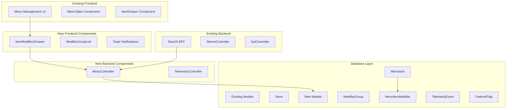
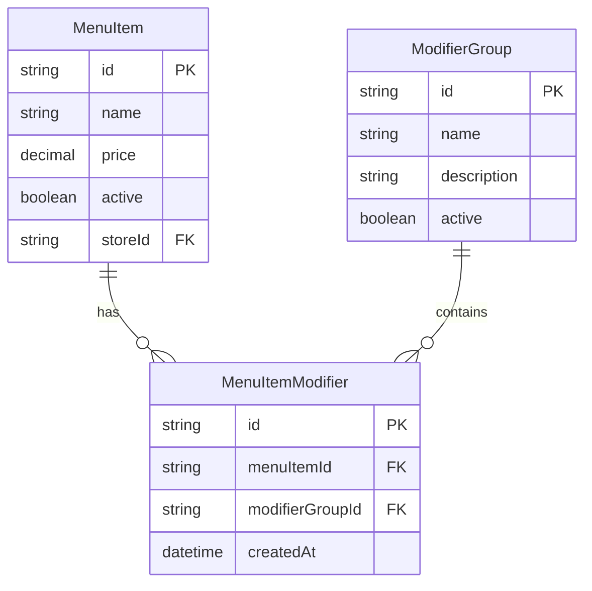
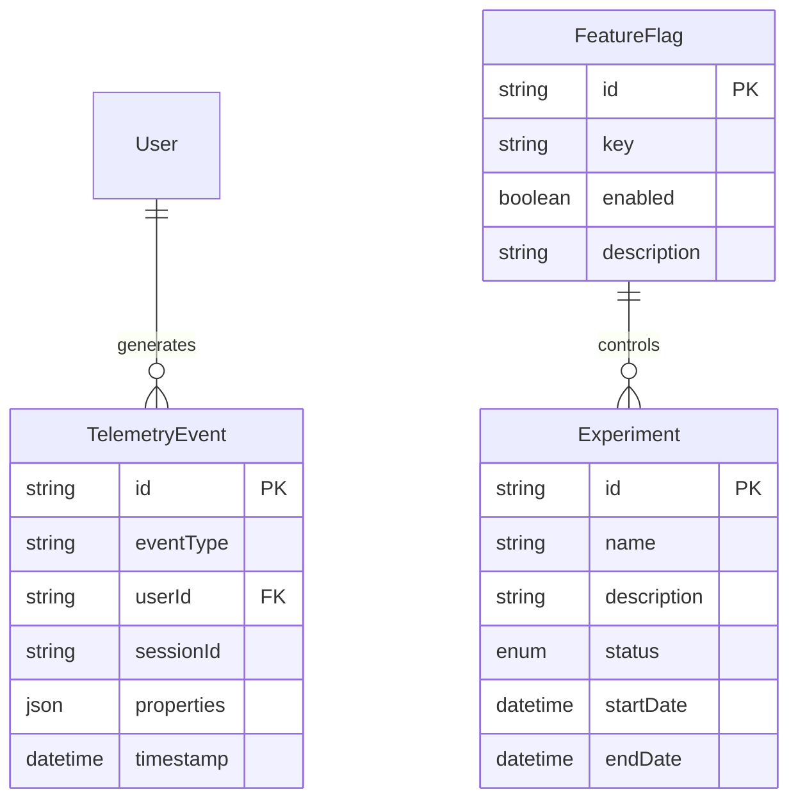

# Design Document

## Overview

The Menu Modifiers and Telemetry Enhancement extends the existing Subway Enterprise system with two key capabilities: a modifier system for menu customization and telemetry infrastructure for future AI features. The design leverages the existing Next.js/NestJS/Prisma architecture while adding new data models, API endpoints, and UI components.

## Architecture

### System Integration

The enhancement integrates with the existing architecture:



## Components and Interfaces

### Database Schema Extensions

**Modifier System Models**
```prisma
model ModifierGroup {
  id          String   @id @default(cuid())
  name        String
  description String?
  active      Boolean  @default(true)
  createdAt   DateTime @default(now())
  updatedAt   DateTime @updatedAt
  
  // Relations
  menuItems   MenuItemModifier[]
  
  @@index([active])
}

model MenuItemModifier {
  id              String        @id @default(cuid())
  menuItemId      String
  modifierGroupId String
  createdAt       DateTime      @default(now())
  
  // Relations
  menuItem        MenuItem      @relation(fields: [menuItemId], references: [id], onDelete: Cascade)
  modifierGroup   ModifierGroup @relation(fields: [modifierGroupId], references: [id], onDelete: Cascade)
  
  @@unique([menuItemId, modifierGroupId])
  @@index([menuItemId])
  @@index([modifierGroupId])
}

// Extend existing MenuItem model
model MenuItem {
  // ... existing fields
  modifiers MenuItemModifier[]
}
```

**Telemetry System Models**
```prisma
model FeatureFlag {
  id          String   @id @default(cuid())
  key         String   @unique
  enabled     Boolean  @default(false)
  description String?
  createdAt   DateTime @default(now())
  updatedAt   DateTime @updatedAt
  
  @@index([key])
  @@index([enabled])
}

model TelemetryEvent {
  id         String   @id @default(cuid())
  eventType  String
  userId     String?
  sessionId  String?
  properties Json?
  timestamp  DateTime @default(now())
  
  @@index([eventType])
  @@index([timestamp])
  @@index([userId])
}

model Experiment {
  id          String           @id @default(cuid())
  name        String           @unique
  description String?
  status      ExperimentStatus @default(DRAFT)
  startDate   DateTime?
  endDate     DateTime?
  createdAt   DateTime         @default(now())
  updatedAt   DateTime         @updatedAt
  
  @@index([status])
  @@index([startDate])
}

enum ExperimentStatus {
  DRAFT
  ACTIVE
  PAUSED
  COMPLETED
}
```

### API Endpoints

**Menu Controller**
```typescript
@Controller()
export class MenuController {
  constructor(@Inject(PrismaClient) private readonly prisma: PrismaClient) {}

  @Get('/menu/items')
  async getMenuItems(@Query() query: MenuItemQueryDto): Promise<MenuItem[]>

  @Post('/menu/items')
  async createMenuItem(@Body() data: CreateMenuItemDto): Promise<{ success: boolean; item?: MenuItem; error?: string }>

  @Get('/menu/modifier-groups')
  async getModifierGroups(): Promise<ModifierGroup[]>

  @Get('/menu/items/:id/modifiers')
  async getItemModifiers(@Param('id') itemId: string): Promise<ModifierGroup[]>

  @Post('/menu/items/:id/modifiers')
  async attachModifier(
    @Param('id') itemId: string,
    @Body() body: { modifierGroupId: string }
  ): Promise<{ success: boolean; error?: string }>

  @Delete('/menu/items/:id/modifiers/:groupId')
  async detachModifier(
    @Param('id') itemId: string,
    @Param('groupId') groupId: string
  ): Promise<{ success: boolean; error?: string }>
}
```

**Telemetry Controller**
```typescript
@Controller()
export class TelemetryController {
  constructor(@Inject(PrismaClient) private readonly prisma: PrismaClient) {}

  @Post('/telemetry')
  async recordEvent(@Body() event: TelemetryEventDto): Promise<{ success: boolean; error?: string }>

  @Get('/feature-flags')
  async getFeatureFlags(): Promise<FeatureFlag[]>

  @Get('/feature-flags/:key')
  async getFeatureFlag(@Param('key') key: string): Promise<FeatureFlag | null>
}
```

### Frontend Components

**ItemModifiersDrawer Component**
```typescript
interface ItemModifiersDrawerProps {
  itemId: string;
  isOpen: boolean;
  onClose: () => void;
}

interface ModifierGroupState {
  available: ModifierGroup[];
  attached: ModifierGroup[];
  loading: boolean;
  error?: string;
}

// Features:
// - Side-by-side display of available vs attached modifiers
// - Optimistic UI updates with rollback on error
// - Loading states and error handling
// - Attach/detach actions with visual feedback
```

**Enhanced ItemDrawer Component**
```typescript
// Enhancements to existing ItemDrawer:
interface ItemFormData {
  name: string;
  price: string;
  active: boolean;
}

interface ItemDrawerState {
  formData: ItemFormData;
  isSubmitting: boolean;
  errors: Record<string, string>;
  showSuccessToast: boolean;
  createAndAddAnother: boolean;
}

// New features:
// - Auto-focus on name field
// - Decimal validation for price
// - Success toast notifications
// - "Create & add another" workflow
// - Inline error display
```

**Toast Notification System**
```typescript
interface ToastProps {
  type: 'success' | 'error' | 'info';
  message: string;
  duration?: number;
  onClose: () => void;
}

// Features:
// - Auto-dismiss after duration
// - Multiple toast stacking
// - Consistent styling with design system
```

## Data Models

### Modifier System Relationships


### Telemetry System Relationships


## Error Handling

### API Error Patterns
```typescript
interface ApiResponse<T> {
  success: boolean;
  data?: T;
  error?: string;
  code?: string;
}

// Consistent error responses across all endpoints
// Proper HTTP status codes
// Structured error messages for UI consumption
```

### UI Error Handling
- **Optimistic Updates**: Immediate UI feedback with rollback on failure
- **Toast Notifications**: Non-intrusive error messages
- **Inline Validation**: Real-time form validation feedback
- **Loading States**: Clear indication of pending operations
- **Graceful Degradation**: Fallback behavior when features fail

### Database Error Handling
- **Constraint Violations**: Mapped to user-friendly messages
- **Unique Key Conflicts**: Handled gracefully in modifier attachments
- **Foreign Key Violations**: Prevented through proper validation
- **Transaction Rollbacks**: Ensure data consistency

## Testing Strategy

### Unit Testing
- **Component Tests**: React Testing Library for UI components
- **Service Tests**: Jest for API controllers and business logic
- **Validation Tests**: Zod schema validation testing

### Integration Testing
- **API Tests**: Supertest for endpoint testing
- **Database Tests**: Prisma test database with cleanup
- **Component Integration**: Testing component-service interactions

### End-to-End Testing
```typescript
describe('Modifier Management', () => {
  test('should attach and detach modifiers', async () => {
    // Navigate to menu page
    // Open modifier drawer for item
    // Attach modifier group
    // Verify in attached list
    // Detach modifier group
    // Verify removed from attached list
  });
});
```

## Implementation Approach

### Phase 1: Database and API Foundation
- Create Prisma migrations for new models
- Implement MenuController with modifier endpoints
- Add basic error handling and validation

### Phase 2: Modifier Management UI
- Build ItemModifiersDrawer component
- Integrate with existing menu table
- Implement optimistic updates

### Phase 3: Enhanced Item Creation
- Enhance ItemDrawer with validation
- Add toast notification system
- Implement "Create & add another" workflow

### Phase 4: Telemetry Infrastructure
- Create telemetry database models
- Implement TelemetryController
- Add development debug tools

### Phase 5: Testing and Seed Data
- Create comprehensive seed data
- Implement test suites
- Ensure proper test coverage

Each phase builds incrementally while maintaining system stability and following established patterns.