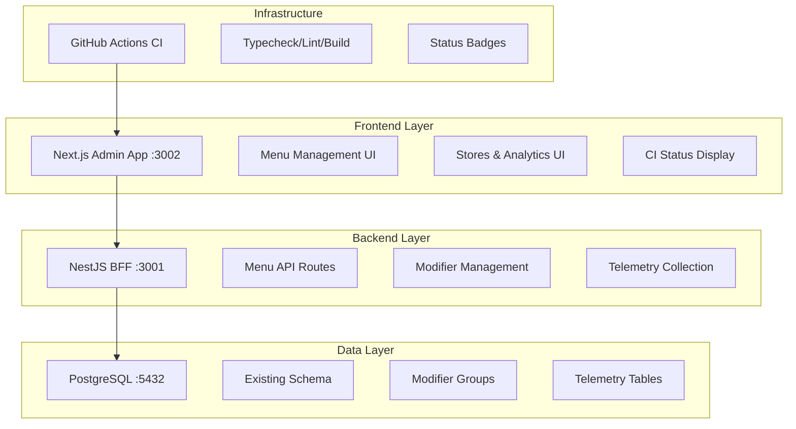
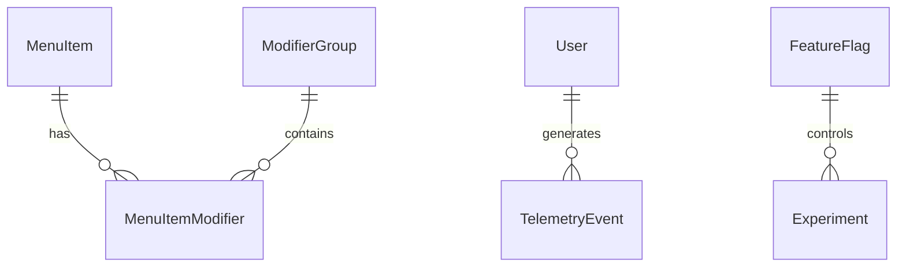

# Design Document

## Overview

The Multi-Phase Delivery System design implements a systematic enhancement approach for the Subway Enterprise platform. The design follows the existing architectural patterns established in the monorepo while introducing new capabilities across 6 distinct phases. Each phase builds incrementally on the previous one, ensuring system stability and maintainability.

The design leverages the existing Next.js App Router frontend, NestJS BFF backend, and Prisma/PostgreSQL database stack while introducing new data models, API endpoints, and UI components as needed.

## Architecture

### System Context

The enhancement operates within the established architecture:



### Phase-Based Implementation Strategy

Each phase introduces specific architectural components:

1. **Phase 0**: CI/CD infrastructure with GitHub Actions
2. **Phase 1**: Menu management enhancements with modifier system
3. **Phase 2**: Enhanced filtering and analytics capabilities
4. **Phase 3**: Improved data entry ergonomics
5. **Phase 4**: Testing infrastructure and seed data
6. **Phase 5**: Telemetry and feature flag foundations

## Components and Interfaces

### Phase 0: CI/CD Infrastructure

**GitHub Actions Workflow**
```yaml
# .github/workflows/ci.yml
name: CI
on: [push, pull_request]
jobs:
  checks:
    runs-on: ubuntu-latest
    steps:
      - uses: actions/checkout@v4
      - uses: pnpm/action-setup@v2
      - run: pnpm install
      - run: pnpm -w run typecheck
      - run: pnpm -w run lint  
      - run: pnpm -w run build
```

**Status Badge Integration**
- README.md updated with build status badge
- Links to GitHub Actions workflow results

### Phase 1: Menu Management System

**Database Schema Extensions**
```prisma
model ModifierGroup {
  id          String   @id @default(cuid())
  name        String
  description String?
  active      Boolean  @default(true)
  createdAt   DateTime @default(now())
  updatedAt   DateTime @updatedAt
  
  // Relations
  items       MenuItemModifier[]
}

model MenuItemModifier {
  id           String      @id @default(cuid())
  menuItemId   String
  modifierGroupId String
  createdAt    DateTime    @default(now())
  
  // Relations
  menuItem     MenuItem    @relation(fields: [menuItemId], references: [id], onDelete: Cascade)
  modifierGroup ModifierGroup @relation(fields: [modifierGroupId], references: [id], onDelete: Cascade)
  
  @@unique([menuItemId, modifierGroupId])
}
```

**API Endpoints**
```typescript
// apps/bff/src/routes/menu.ts
@Controller()
export class MenuController {
  @Get('/menu/modifier-groups')
  async getModifierGroups(): Promise<ModifierGroup[]>
  
  @Get('/menu/items/:id/modifiers')
  async getItemModifiers(@Param('id') id: string): Promise<ModifierGroup[]>
  
  @Post('/menu/items/:id/modifiers')
  async attachModifier(@Param('id') id: string, @Body() body: { groupId: string })
  
  @Delete('/menu/items/:id/modifiers/:groupId')
  async detachModifier(@Param('id') id: string, @Param('groupId') groupId: string)
}
```

**UI Components**
```typescript
// apps/admin/app/menu/ItemModifiersDrawer.tsx
interface ItemModifiersDrawerProps {
  itemId: string;
  isOpen: boolean;
  onClose: () => void;
}

// Features:
// - Available vs Attached modifier groups display
// - Optimistic UI updates with error handling
// - Attach/Detach buttons with loading states
```

**Menu Table Enhancements**
- Column alignment: center all except first column (left-aligned)
- Compact header controls with 12-16px spacing
- Right-sliding drawer without content displacement
- ESC key handler for drawer closure

### Phase 2: Stores & Analytics Enhancement

**Cascading Filter System**
```typescript
// apps/admin/app/stores/components/CascadingFilters.tsx
interface FilterState {
  region?: string;
  country?: string;
  city?: string;
}

// Features:
// - Region selection updates available countries
// - Country selection updates available cities
// - Query string synchronization
// - State persistence on page refresh
```

**Analytics Filter Integration**
```typescript
// apps/admin/app/analytics/components/AnalyticsFilters.tsx
// Features:
// - Live-updating KPI cards (no Apply button)
// - Unified styling with .s-input/.s-select/.s-btn classes
// - Scope parameter integration with existing /kpis endpoints
```

### Phase 3: Menu Data Ergonomics

**Enhanced Item Creation Form**
```typescript
// apps/admin/app/menu/ItemDrawer.tsx enhancements
interface ItemFormState {
  name: string;
  price: string;
  category: string; // Auto-populated from filter
  active: boolean;
}

// Features:
// - Auto-focus on name field
// - Decimal validation for price input
// - Success toast notifications
// - "Create & add another" workflow
```

### Phase 4: Testing Infrastructure

**Seed Data Enhancement**
```javascript
// packages/db/prisma/seed.mjs additions
const modifierGroups = [
  { name: 'Bread', description: 'Bread options' },
  { name: 'Extras', description: 'Additional toppings' }
];

// Creates sample menu item with attached modifier
```

**Test Structure**
```
apps/bff/test/
├── menu.e2e.spec.ts
└── modifiers.integration.spec.ts

apps/admin/test/
└── menu-modifiers.e2e.spec.ts
```

### Phase 5: AI Foundations

**Telemetry Schema**
```prisma
model FeatureFlag {
  id          String   @id @default(cuid())
  key         String   @unique
  enabled     Boolean  @default(false)
  description String?
  createdAt   DateTime @default(now())
  updatedAt   DateTime @updatedAt
}

model TelemetryEvent {
  id         String   @id @default(cuid())
  eventType  String
  userId     String?
  sessionId  String?
  properties Json?
  timestamp  DateTime @default(now())
  
  @@index([eventType])
  @@index([timestamp])
}

model Experiment {
  id          String   @id @default(cuid())
  name        String   @unique
  description String?
  status      ExperimentStatus @default(DRAFT)
  startDate   DateTime?
  endDate     DateTime?
  createdAt   DateTime @default(now())
  updatedAt   DateTime @updatedAt
}

enum ExperimentStatus {
  DRAFT
  ACTIVE
  PAUSED
  COMPLETED
}
```

**Telemetry API**
```typescript
// apps/bff/src/routes/telemetry.ts
@Controller()
export class TelemetryController {
  @Post('/telemetry')
  async recordEvent(@Body() event: TelemetryEventDto): Promise<{ success: boolean }>
}
```

## Data Models

### Existing Models (Enhanced)
- **MenuItem**: Extended with modifier relationships
- **Store**: Maintains existing region/country structure
- **User**: Unchanged, used for telemetry user tracking

### New Models
- **ModifierGroup**: Represents categories of modifiers (Bread, Extras, etc.)
- **MenuItemModifier**: Junction table for many-to-many relationship
- **FeatureFlag**: Boolean flags for feature toggles
- **TelemetryEvent**: Event tracking for user interactions
- **Experiment**: A/B test configuration and tracking

### Data Relationships


## Error Handling

### API Error Patterns
```typescript
// Standardized error response format
interface ApiError {
  success: false;
  error: string;
  code?: string;
  details?: any;
}

// Optimistic UI error handling
interface OptimisticUpdate {
  rollback: () => void;
  retry: () => Promise<void>;
  onError: (error: ApiError) => void;
}
```

### UI Error States
- **Network Errors**: Toast notifications with retry options
- **Validation Errors**: Inline field-level error messages
- **Permission Errors**: Graceful degradation with user feedback
- **Loading States**: Skeleton components and loading indicators

### Database Error Handling
- **Constraint Violations**: Mapped to user-friendly messages
- **Connection Issues**: Automatic retry with exponential backoff
- **Migration Failures**: Rollback procedures and notifications

## Testing Strategy

### Unit Testing
- **Component Tests**: React Testing Library for UI components
- **Service Tests**: Jest for business logic and API services
- **Utility Tests**: Pure function testing for helpers and validators

### Integration Testing
- **API Tests**: Supertest for BFF endpoint testing
- **Database Tests**: Prisma test database with transaction rollbacks
- **Component Integration**: Testing component-service interactions

### End-to-End Testing
```typescript
// apps/admin/test/menu-modifiers.e2e.spec.ts
describe('Menu Modifier Management', () => {
  test('should attach modifier to menu item', async () => {
    // Navigate to menu page
    // Click modifiers button for item
    // Select available modifier group
    // Click attach
    // Verify modifier appears in attached list
  });
});
```

### Performance Testing
- **Load Testing**: API endpoint performance under load
- **UI Performance**: Core Web Vitals monitoring
- **Database Performance**: Query optimization and indexing

### Testing Infrastructure
- **CI Integration**: Automated test runs on PR creation
- **Test Data**: Consistent seed data for reproducible tests
- **Coverage Reporting**: Minimum 80% coverage requirement
- **Visual Regression**: Screenshot comparison for UI changes

## Implementation Phases

### Phase 0: Foundation (1 PR)
- GitHub Actions CI workflow
- Status badge integration
- Build/lint/typecheck automation

### Phase 1A: Menu UX Polish (1 PR)
- Table alignment improvements
- Header control compaction
- Drawer behavior fixes

### Phase 1B: Modifier System (1 PR)
- Database schema additions
- BFF API endpoints
- Modifier management UI

### Phase 2A: Store Filters (1 PR)
- Cascading filter implementation
- Query string state management

### Phase 2B: Analytics Enhancement (1 PR)
- Live-updating KPI cards
- Unified filter styling

### Phase 3: Data Ergonomics (1 PR)
- Enhanced item creation form
- Auto-focus and validation
- Success feedback

### Phase 4: Testing Infrastructure (1 PR)
- Seed data enhancements
- E2E test implementation
- Test automation

### Phase 5: AI Foundations (1 PR)
- Telemetry schema and API
- Feature flag infrastructure
- Debug tooling

Each phase maintains backward compatibility and follows the established architectural patterns while introducing incremental improvements to the system.