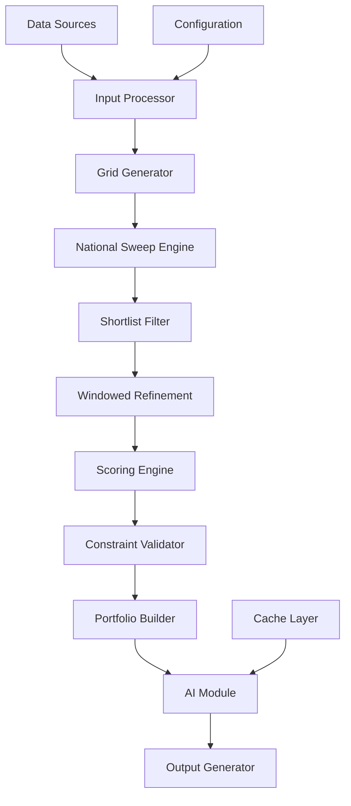

# Design Document

## Overview

The National Store Location Generator is a geospatial analysis system that generates optimal store location recommendations for any country using a deterministic, multi-stage pipeline. The system combines grid-based coverage analysis, constraint-based filtering, and optional AI-powered insights while maintaining strict cost controls and reproducible results.

## Architecture

### High-Level Architecture



### System Components

1. **Input Processor**: Validates and normalizes input data (boundaries, existing stores, population, etc.)
2. **Grid Generator**: Creates uniform H3 grid coverage for the target country
3. **National Sweep Engine**: Computes basic features for all grid cells
4. **Shortlist Filter**: Applies fairness and coverage gap filtering
5. **Windowed Refinement**: Performs detailed analysis on promising candidates
6. **Scoring Engine**: Calculates weighted scores using multiple factors
7. **Constraint Validator**: Enforces spacing and fairness rules
8. **Portfolio Builder**: Selects final locations using greedy optimization
9. **AI Module**: Optional component for weight adjustment and rationale generation
10. **Output Generator**: Formats results with diagnostics and validation

## Components and Interfaces

### Core Data Models

```typescript
interface CountryConfig {
  countryCode: string;
  boundary: GeoJSON.Polygon;
  administrativeRegions: AdministrativeRegion[];
  majorMetropolitanAreas: string[];
  maxRegionShare: number; // default 0.4
}

interface AdministrativeRegion {
  id: string;
  name: string;
  boundary: GeoJSON.Polygon;
  population: number;
}

interface LocationCandidate {
  id: string;
  lat: number;
  lng: number;
  h3Index: string;
  administrativeRegion: string;
  features: CandidateFeatures;
  scores: ScoreBreakdown;
  constraints: ConstraintStatus;
  dataQuality: DataQuality;
}

interface CandidateFeatures {
  population: number;
  nearestBrandKm: number;
  competitorDensity: number;
  anchors: AnchorData;
  performanceProxy: number;
}

interface AnchorData {
  raw: number;
  deduplicated: number;
  diminishingScore: number;
  breakdown: Record<AnchorType, number>;
}

interface ScoreBreakdown {
  population: number;
  gap: number;
  anchor: number;
  performance: number;
  saturationPenalty: number;
  final: number;
}
```

### Input/Output Interfaces

```typescript
interface GenerationRequest {
  country: CountryConfig;
  existingStores: ExistingStore[];
  competitors?: CompetitorLocation[];
  populationData: PopulationGrid;
  anchors?: AnchorPoint[];
  config: GenerationConfig;
}

interface GenerationConfig {
  targetK: number;
  minSpacingM: number;
  gridResolution: number; // H3 resolution 8-9
  weights: ScoreWeights;
  enableAI: boolean;
  mode?: 'Defend' | 'Balanced' | 'Blitz';
}

interface GenerationResult {
  sites: LocationCandidate[];
  portfolio: PortfolioSummary;
  diagnostics: SystemDiagnostics;
  reproducibility: ReproducibilityInfo;
}
```

### Service Interfaces

```typescript
interface IGridService {
  generateCountryGrid(boundary: GeoJSON.Polygon, resolution: number): H3Cell[];
  getNeighbors(cell: H3Cell, radius: number): H3Cell[];
}

interface IFeatureService {
  computeBasicFeatures(cell: H3Cell, context: AnalysisContext): CandidateFeatures;
  computeRefinedFeatures(cell: H3Cell, context: AnalysisContext): CandidateFeatures;
}

interface IScoringService {
  calculateScores(features: CandidateFeatures, weights: ScoreWeights): ScoreBreakdown;
  normalizeScores(candidates: LocationCandidate[]): LocationCandidate[];
}

interface IConstraintService {
  validateSpacing(candidate: LocationCandidate, existing: LocationCandidate[]): boolean;
  validateRegionalShare(candidates: LocationCandidate[], config: CountryConfig): boolean;
}

interface IAIService {
  adjustWeights(mode: string, baseWeights: ScoreWeights): Promise<ScoreWeights>;
  generateRationales(candidates: LocationCandidate[]): Promise<string[]>;
}
```

## Data Models

### Geographic Data Structure

The system uses H3 hexagonal indexing for uniform grid coverage:

- **Resolution 8**: ~0.7 km² cells for national sweep
- **Resolution 9**: ~0.1 km² cells for detailed refinement
- **Buffer zones**: 5-10km around refinement windows

### Feature Computation Pipeline

#### Basic Features (National Sweep)
- **Population**: Aggregated from census tiles within cell radius
- **Nearest Brand Distance**: Haversine distance to closest existing store
- **Competitor Density**: Count of competitors within 2km radius
- **Anchor Proxy**: OSM-based counts of POI categories

#### Refined Features (Shortlisted Only)
- **Travel-time Catchments**: Cached isochrone analysis where available
- **Detailed Anchor Analysis**: Type-specific deduplication and scoring
- **Performance Proxy**: Market-based estimates or default values

### Anchor Deduplication Logic

```typescript
const MERGE_RADII = {
  'mall-tenant': 120, // meters
  'station-shops': 100,
  'grocer-grocer': 60,
  'retail-retail': 60
};

function deduplicateAnchors(anchors: AnchorPoint[]): AnchorPoint[] {
  // Group by type, apply spatial clustering within merge radius
  // Apply diminishing returns: Σ 1/√rank, max 25 anchors
}
```

## Error Handling

### Data Quality Management

```typescript
interface DataQuality {
  completeness: number; // 0-1 scale
  estimated: {
    population: boolean;
    anchors: boolean;
    travelTime: boolean;
  };
  confidence: number;
}

// Quality gates
const MIN_COMPLETENESS = 0.5;
const MIN_ACCEPTANCE_RATE = 0.15;
```

### Fallback Strategies

1. **Missing Travel-time Data**: Fall back to radial distance calculations
2. **Sparse Population Data**: Use administrative region averages with reduced weight
3. **Missing Anchor Data**: Use OSM proxy counts with estimated flag
4. **AI Service Failure**: Continue with deterministic weights and cached rationales

### Constraint Violation Handling

```typescript
enum RejectionReason {
  SPACING_VIOLATION = 'spacing',
  REGIONAL_SHARE_EXCEEDED = 'regional_share',
  LOW_COMPLETENESS = 'data_quality',
  SATURATION_PENALTY = 'market_saturation'
}

interface ConstraintViolation {
  reason: RejectionReason;
  details: string;
  suggestedAction?: string;
}
```

## Testing Strategy

### Unit Testing
- **Grid Generation**: Validate H3 cell coverage and resolution
- **Feature Computation**: Test scoring algorithms with known inputs
- **Constraint Validation**: Verify spacing and fairness rule enforcement
- **Anchor Deduplication**: Test merge logic with overlapping POIs

### Integration Testing
- **End-to-End Pipeline**: Process sample country data through full pipeline
- **Data Quality Scenarios**: Test handling of sparse/estimated data
- **AI Module Integration**: Mock AI service responses and caching
- **Performance Testing**: Validate processing time limits

### Validation Testing
- **Reproducibility**: Same inputs produce identical outputs
- **Fairness Validation**: Regional distribution meets constraints
- **Sanity Checks**: Major metropolitan areas appear in results
- **Cost Control**: AI token usage stays within limits

### Test Data Sets
- **Germany**: Full dataset with known ground truth
- **Synthetic Country**: Controlled test case with predictable results
- **Edge Cases**: Small countries, island nations, sparse data regions

## Performance Considerations

### Computational Optimization
- **Grid Resolution**: Balance coverage vs. computation time
- **Windowed Processing**: Limit refined analysis to shortlisted candidates
- **Spatial Indexing**: Use R-tree for efficient neighbor queries
- **Caching Strategy**: Cache expensive computations (travel-time, AI results)

### Memory Management
- **Streaming Processing**: Process large grids in chunks
- **Feature Compression**: Store only essential data for each candidate
- **Garbage Collection**: Clean up intermediate results after processing

### Scalability Targets
- **Processing Time**: <10 minutes for 300 locations
- **Memory Usage**: <4GB peak for largest countries
- **Cache Size**: <1GB for 24-hour AI result cache
- **Concurrent Requests**: Support 5 simultaneous country analyses

## AI Integration Design

### Token Budget Management
```typescript
interface AIBudget {
  maxTokensPerRun: number; // 20,000
  reservedForWeights: number; // 1,000
  reservedForRationales: number; // 19,000
  currentUsage: number;
}
```

### Caching Strategy
```typescript
interface CacheKey {
  countryHash: string;
  featuresHash: string;
  mode: string;
  version: string;
}

interface CachedResult {
  weights?: ScoreWeights;
  rationales?: Record<string, string>;
  timestamp: number;
  tokenCost: number;
}
```

### Fallback Behavior
- **Weight Adjustment**: Use mode-based multipliers if AI fails
- **Rationale Generation**: Provide template-based rationales from features
- **Cost Overrun**: Stop AI processing, continue with cached/default values