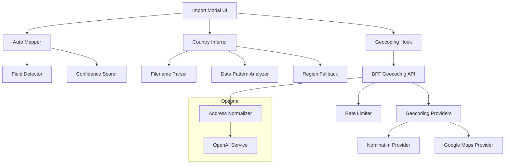

# Design Document

## Overview

The Smart Store Importer v1 enhances the existing store import functionality with intelligent automation while maintaining backward compatibility. The design focuses on three core capabilities: automatic column mapping with confidence scoring, intelligent country inference from multiple data sources, and background geocoding with progress tracking.

## Architecture

### High-Level Architecture



### Component Interaction Flow

1. **File Upload**: User uploads spreadsheet → Auto Mapper analyzes headers and samples
2. **Field Mapping**: Confidence indicators displayed → User reviews/adjusts mappings
3. **Country Detection**: Country Inferrer runs analysis → Results displayed with edit option
4. **Import Initiation**: User clicks "Import & Geocode" → Geocoding Hook orchestrates process
5. **Background Processing**: BFF handles batched geocoding with rate limiting and progress updates
6. **Completion**: Results displayed with error handling and map updates

## Components and Interfaces

### Frontend Components (apps/admin)

#### Auto Mapper (`lib/import/autoMap.ts`)
```typescript
interface FieldMapping {
  field: string;
  confidence: 'high' | 'medium' | 'low';
  reason: string;
  suggestedColumn?: string;
}

interface AutoMapResult {
  mappings: Record<string, FieldMapping>;
  unmappedColumns: string[];
  confidenceSummary: {
    high: number;
    medium: number;
    low: number;
  };
}

class AutoMapper {
  analyzeHeaders(headers: string[]): Record<string, number>;
  validateSampleData(column: string, samples: any[]): number;
  generateMappings(headers: string[], sampleRows: any[]): AutoMapResult;
}
```

#### Country Inferrer (`lib/import/countryInference.ts`)
```typescript
interface CountryInference {
  country: string;
  confidence: 'high' | 'medium' | 'low';
  method: 'column' | 'filename' | 'format' | 'fallback';
  displayText: string;
}

class CountryInferrer {
  inferFromFilename(filename: string): CountryInference | null;
  inferFromDataPatterns(sampleRows: any[]): CountryInference | null;
  inferFromRegionFallback(userRegion?: string): CountryInference | null;
  inferCountry(filename: string, sampleRows: any[], userRegion?: string): CountryInference;
}
```

#### Geocoding Hook (`hooks/useGeocodeImport.ts`)
```typescript
interface GeocodeProgress {
  total: number;
  completed: number;
  failed: number;
  inProgress: boolean;
  errors: GeocodeError[];
}

interface GeocodeError {
  rowId: string;
  address: string;
  reason: string;
}

const useGeocodeImport = () => {
  const [progress, setProgress] = useState<GeocodeProgress>();
  
  const startGeocoding = (rows: ImportRow[]) => Promise<GeocodeResult>;
  const cancelGeocoding = () => void;
  
  return { progress, startGeocoding, cancelGeocoding };
};
```

#### Enhanced Import Modal (`components/import/ImportModal.tsx`)
- Integrates auto-mapping with confidence badges
- Shows country inference with edit capability
- Displays real-time geocoding progress
- Maintains existing preview functionality
- Handles error states and recovery

### Backend Components (apps/bff)

#### Geocoding API (`routes/import/geocode.ts`)
```typescript
interface GeocodeRequest {
  providerPreference?: 'google' | 'nominatim';
  rows: Array<{
    id: string;
    address: string;
    city: string;
    postcode: string;
    country: string;
  }>;
}

interface GeocodeResponse {
  results: Array<{
    id: string;
    lat?: number;
    lng?: number;
    precision?: string;
    provider?: string;
    error?: string;
  }>;
}

@Post('/import/geocode')
async geocodeAddresses(@Body() request: GeocodeRequest): Promise<GeocodeResponse>
```

#### Provider Abstraction (`lib/geocode/providers/`)
```typescript
interface GeocodeResult {
  lat: number;
  lng: number;
  precision: string;
  provider: string;
}

interface GeocodeError {
  error: string;
  retryable: boolean;
}

abstract class GeocodeProvider {
  abstract geocode(address: string): Promise<GeocodeResult | GeocodeError>;
  abstract getRateLimit(): number;
  abstract getName(): string;
}

class NominatimProvider extends GeocodeProvider {
  // Implements OSM Nominatim with proper headers and rate limiting
}

class GoogleMapsProvider extends GeocodeProvider {
  // Implements Google Maps Geocoding API
}
```

#### Rate Limiter (`lib/geocode/rateLimiter.ts`)
```typescript
class TokenBucketRateLimiter {
  constructor(tokensPerSecond: number, bucketSize: number);
  
  async acquire(): Promise<void>;
  getAvailableTokens(): number;
}
```

## Data Models

### Enhanced Import Types
```typescript
interface ImportRow {
  id: string;
  name?: string;
  address?: string;
  city?: string;
  postcode?: string;
  country?: string;
  latitude?: number;
  longitude?: number;
  status?: string;
  externalId?: string;
  geocodeStatus?: 'pending' | 'success' | 'failed' | 'needs_review';
  geocodeError?: string;
}

interface ImportSession {
  id: string;
  filename: string;
  totalRows: number;
  mappings: Record<string, string>;
  countryInference: CountryInference;
  progress: {
    imported: number;
    geocoded: number;
    failed: number;
  };
  createdAt: Date;
}
```

### Optional Database Extensions (packages/db)
```prisma
// Only if persistent job tracking is needed
model ImportAttempt {
  id        String   @id @default(cuid())
  sessionId String
  rowData   Json
  status    String   // 'pending' | 'success' | 'failed'
  error     String?
  createdAt DateTime @default(now())
  updatedAt DateTime @updatedAt
  
  @@map("import_attempts")
}
```

## Error Handling

### Geocoding Error Categories
1. **Retryable Errors**: Rate limits (429), server errors (5xx)
2. **Non-retryable Errors**: Invalid addresses, quota exceeded
3. **Timeout Errors**: Request timeouts with configurable limits

### Error Recovery Strategy
```typescript
class GeocodeErrorHandler {
  async handleError(error: any, attempt: number): Promise<'retry' | 'fail'> {
    if (attempt >= MAX_RETRIES) return 'fail';
    
    if (error.status === 429 || error.status >= 500) {
      await this.exponentialBackoff(attempt);
      return 'retry';
    }
    
    return 'fail';
  }
  
  private async exponentialBackoff(attempt: number): Promise<void> {
    const delay = Math.min(1000 * Math.pow(2, attempt), 30000);
    const jitter = Math.random() * 0.1 * delay;
    await new Promise(resolve => setTimeout(resolve, delay + jitter));
  }
}
```

## Testing Strategy

### Unit Tests
- **Auto Mapper**: Header recognition, sample validation, confidence scoring
- **Country Inferrer**: Filename parsing, data pattern detection, fallback logic
- **Geocoding Providers**: API integration, error handling, rate limiting
- **Rate Limiter**: Token bucket algorithm, concurrent request handling

### Integration Tests
- **Import Flow**: End-to-end file upload through geocoding completion
- **Error Scenarios**: Network failures, invalid data, rate limit handling
- **Performance**: Large file processing, memory usage, UI responsiveness

### E2E Tests (Playwright)
```typescript
test('Germany spreadsheet auto-import workflow', async ({ page }) => {
  // Upload file and verify auto-mapping
  await page.setInputFiles('[data-testid="file-input"]', 'germany-stores.xlsx');
  await expect(page.locator('[data-testid="confidence-high"]')).toHaveCount(6);
  
  // Verify country inference
  await expect(page.locator('[data-testid="inferred-country"]')).toContainText('Germany 🇩🇪');
  
  // Start import and monitor progress
  await page.click('[data-testid="import-geocode-btn"]');
  await expect(page.locator('[data-testid="progress-bar"]')).toBeVisible();
  
  // Verify completion and map updates
  await expect(page.locator('[data-testid="import-complete"]')).toBeVisible();
  await expect(page.locator('[data-testid="map-markers"]')).toHaveCount(30);
});
```

## Performance Considerations

### Frontend Optimizations
- **Debounced Preview Updates**: 200ms debounce on field mapping changes
- **Virtual Scrolling**: For large data preview tables
- **Memoized Calculations**: Auto-mapping and confidence scoring results
- **Abort Controllers**: Cancel in-flight requests when modal closes

### Backend Optimizations
- **Batch Processing**: Process geocoding in configurable chunks (10-20 rows)
- **Connection Pooling**: Reuse HTTP connections for provider requests
- **Caching**: Cache successful geocoding results by normalized address
- **Memory Management**: Stream large file processing, avoid loading entire datasets

### Rate Limiting Strategy
```typescript
const PROVIDER_LIMITS = {
  nominatim: { requestsPerSecond: 1, burstSize: 5 },
  google: { requestsPerSecond: 10, burstSize: 50 }
};
```

## Configuration

### Environment Variables
```bash
# Geocoding Providers
NOMINATIM_URL=https://nominatim.openstreetmap.org
GOOGLE_MAPS_API_KEY=optional_google_key

# Feature Flags
IMPORT_ADDRESS_NORMALIZE=false
OPENAI_API_KEY=optional_openai_key

# Performance Tuning
GEOCODE_BATCH_SIZE=15
GEOCODE_RATE_LIMIT=5
GEOCODE_TIMEOUT_MS=10000
```

### Provider Configuration
```typescript
const providerConfig = {
  nominatim: {
    baseUrl: process.env.NOMINATIM_URL,
    userAgent: 'SubwayEnterprise/1.0 (admin@subway.com)',
    rateLimit: 1, // requests per second
    timeout: 10000
  },
  google: {
    apiKey: process.env.GOOGLE_MAPS_API_KEY,
    rateLimit: 10,
    timeout: 5000
  }
};
```

## Security Considerations

### Data Protection
- Validate all uploaded files for malicious content
- Sanitize address data before sending to external APIs
- Implement request size limits and timeout protections
- Log geocoding requests for audit purposes (without sensitive data)

### API Security
- Include proper User-Agent headers for Nominatim compliance
- Implement API key rotation for Google Maps
- Rate limit per-user to prevent abuse
- Validate and sanitize all geocoding responses

## Monitoring and Telemetry

### Key Metrics
```typescript
const telemetryEvents = {
  'importer_automap_done': { confidenceCounts: { high: 6, medium: 2, low: 1 } },
  'importer_country_inferred': { method: 'filename', country: 'DE' },
  'importer_geocode_started': { rows: 30, provider: 'nominatim' },
  'importer_geocode_progress': { done: 15, total: 30 },
  'importer_geocode_complete': { success: 28, failed: 2 }
};
```

### Performance Monitoring
- Track geocoding response times by provider
- Monitor rate limit hit rates and backoff effectiveness
- Measure UI responsiveness during background operations
- Alert on excessive geocoding failure rates