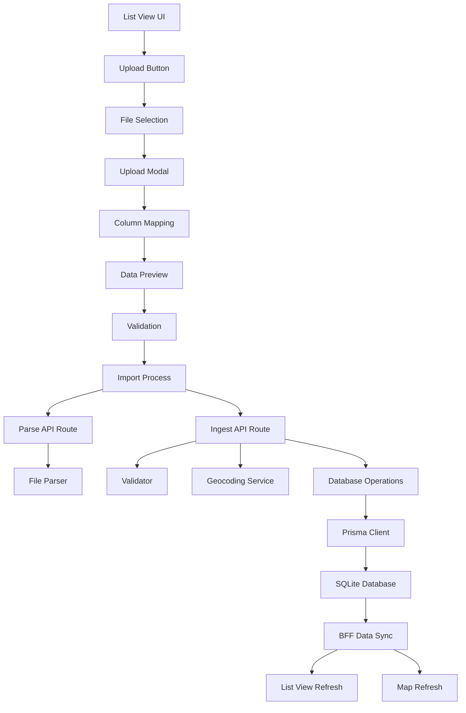

# Design Document

## Overview

The Store Data Upload feature provides a comprehensive solution for bulk importing store location data through Excel and CSV files. The feature integrates seamlessly into the existing List View interface, offering real-time preview, validation, geocoding, and database ingestion capabilities while maintaining system performance and data integrity.

## Architecture

### High-Level Architecture



### Component Architecture

The feature follows a modular component architecture with clear separation of concerns:

1. **UI Layer**: React components for user interaction
2. **API Layer**: Next.js API routes for server-side processing
3. **Service Layer**: Business logic for parsing, validation, and geocoding
4. **Data Layer**: Prisma client for database operations

## Components and Interfaces

### Core Components

#### 1. UploadStoreData Component
**Location**: `apps/admin/app/stores/components/UploadStoreData.tsx`

```typescript
interface UploadStoreDataProps {
  onUploadSuccess: (summary: ImportSummary) => void;
  onRefreshData: () => void;
}

interface ImportSummary {
  inserted: number;
  updated: number;
  pendingGeocode: number;
  failed: number;
}
```

**Responsibilities**:
- Render upload button with feature flag check
- Handle file selection and drag-and-drop
- Trigger file parsing via API
- Open preview modal on successful parse

#### 2. PreviewModal Component
**Location**: `apps/admin/app/stores/components/PreviewModal.tsx`

```typescript
interface PreviewModalProps {
  isOpen: boolean;
  detectedHeaders: string[];
  sampleRows: ParsedRow[];
  suggestedMapping: ColumnMapping;
  onClose: () => void;
  onImport: (mapping: ColumnMapping) => Promise<void>;
}

interface ParsedRow {
  index: number;
  data: Record<string, any>;
  validationStatus: 'valid' | 'invalid' | 'duplicate';
  validationErrors: string[];
  isDuplicate: boolean;
  duplicateOf?: string;
}

interface ColumnMapping {
  name?: string;
  address?: string;
  city?: string;
  postcode?: string;
  country?: string;
  latitude?: string;
  longitude?: string;
  externalId?: string;
  status?: string;
}
```

**Responsibilities**:
- Display column mapping interface with dropdowns
- Show data preview table with validation indicators
- Handle user mapping corrections
- Trigger import process with final mapping

#### 3. ProgressIndicator Component
**Location**: `apps/admin/app/stores/components/ProgressIndicator.tsx`

```typescript
interface ProgressIndicatorProps {
  currentStep: 'parse' | 'validate' | 'geocode' | 'upsert' | 'refresh';
  progress: number; // 0-100
  message: string;
}
```

**Responsibilities**:
- Display current processing step
- Show progress bar for long operations
- Provide user feedback during import

### API Routes

#### 1. Upload Route
**Location**: `apps/admin/app/api/stores/upload/route.ts`

```typescript
// POST /api/stores/upload
interface UploadRequest {
  file: File; // multipart/form-data
}

interface UploadResponse {
  success: boolean;
  data?: {
    headers: string[];
    sampleRows: ParsedRow[];
    suggestedMapping: ColumnMapping;
    totalRows: number;
  };
  error?: string;
}
```

**Responsibilities**:
- Accept multipart file uploads
- Parse Excel/CSV files using appropriate libraries
- Detect column headers and suggest mappings
- Return sample data for preview
- Validate file size and format

#### 2. Ingest Route
**Location**: `apps/admin/app/api/stores/ingest/route.ts`

```typescript
// POST /api/stores/ingest
interface IngestRequest {
  mapping: ColumnMapping;
  rows: ParsedRow[];
}

interface IngestResponse {
  success: boolean;
  data?: ImportSummary;
  error?: string;
}
```

**Responsibilities**:
- Validate feature flags and permissions
- Apply column mapping to raw data
- Validate and normalize store data
- Execute geocoding pipeline
- Perform database upsert operations
- Return import summary

### Service Components

#### 1. File Parser Service
**Location**: `apps/admin/lib/services/file-parser.ts`

```typescript
interface FileParserService {
  parseExcel(buffer: Buffer): Promise<ParseResult>;
  parseCSV(buffer: Buffer): Promise<ParseResult>;
  detectHeaders(rows: any[][]): string[];
  suggestMapping(headers: string[]): ColumnMapping;
}

interface ParseResult {
  headers: string[];
  rows: any[][];
  totalRows: number;
}
```

**Responsibilities**:
- Parse Excel files using xlsx library
- Parse CSV files with proper encoding detection
- Implement header detection heuristics
- Suggest column mappings based on common patterns

#### 2. Geocoding Service
**Location**: `apps/admin/lib/services/geocoding.ts`

```typescript
interface GeocodingService {
  geocodeAddress(address: GeocodeRequest): Promise<GeocodeResult>;
  batchGeocode(addresses: GeocodeRequest[]): Promise<GeocodeResult[]>;
}

interface GeocodeRequest {
  address: string;
  city: string;
  postcode?: string;
  country: string;
}

interface GeocodeResult {
  latitude?: number;
  longitude?: number;
  accuracy?: string;
  provider: 'mapbox' | 'google' | 'nominatim';
  status: 'success' | 'failed' | 'pending';
  raw?: any;
}
```

**Responsibilities**:
- Implement provider fallback chain (Mapbox → Google → Nominatim)
- Handle rate limiting and throttling
- Batch processing for efficiency
- Error handling and retry logic

#### 3. Validation Service
**Location**: `apps/admin/lib/services/validation.ts`

```typescript
interface ValidationService {
  validateStoreData(data: any, mapping: ColumnMapping): ValidationResult;
  normalizeStoreData(data: any): NormalizedStore;
  detectDuplicates(stores: NormalizedStore[]): DuplicateInfo[];
}

interface ValidationResult {
  isValid: boolean;
  errors: string[];
  warnings: string[];
}

interface NormalizedStore {
  name: string;
  address: string;
  city: string;
  postcode?: string;
  country: string;
  latitude?: number;
  longitude?: number;
  externalId?: string;
  status?: string;
}
```

**Responsibilities**:
- Validate required fields and data types
- Normalize text fields (trim, title case, etc.)
- Detect duplicates using multiple strategies
- Generate validation error messages

## Data Models

### Upload Data Schema

```typescript
// Zod schema for upload validation
const StoreUploadSchema = z.object({
  name: z.string().min(1).max(255),
  address: z.string().min(1).max(500),
  city: z.string().min(1).max(100),
  postcode: z.string().max(20).optional(),
  country: z.string().min(2).max(100),
  latitude: z.number().min(-90).max(90).optional(),
  longitude: z.number().min(-180).max(180).optional(),
  externalId: z.string().max(100).optional(),
  status: z.enum(['open', 'planned', 'closed']).optional()
});

type StoreUploadData = z.infer<typeof StoreUploadSchema>;
```

### Database Integration

The feature integrates with the existing Store model in Prisma schema:

```prisma
model Store {
  id             String   @id @default(uuid())
  name           String
  country        String?
  region         String?
  city           String?
  latitude       Float?
  longitude      Float?
  // New optional field for geocoding status
  geocodeStatus  String?  // 'success' | 'pending' | 'failed'
  createdAt      DateTime @default(now())
  updatedAt      DateTime @updatedAt
  // ... existing relations
}
```

**Note**: The `geocodeStatus` field is optional and will be added only if it doesn't exist in the current schema.

## Error Handling

### Error Categories

1. **File Errors**: Invalid format, corrupted files, size limits
2. **Validation Errors**: Missing required fields, invalid data types
3. **Geocoding Errors**: API failures, rate limits, invalid addresses
4. **Database Errors**: Constraint violations, connection issues
5. **Feature Flag Errors**: Disabled features, permission issues

### Error Response Format

```typescript
interface ErrorResponse {
  success: false;
  error: string;
  code: string;
  details?: any;
  timestamp: string;
}
```

### Error Handling Strategy

- **Client-side**: Toast notifications for user-facing errors
- **Server-side**: Structured logging with error codes
- **Graceful degradation**: Partial success handling
- **Retry mechanisms**: For transient failures

## Testing Strategy

### Unit Tests

1. **File Parser Tests**
   - Excel/CSV parsing accuracy
   - Header detection algorithms
   - Mapping suggestion logic

2. **Validation Tests**
   - Schema validation edge cases
   - Normalization functions
   - Duplicate detection accuracy

3. **Geocoding Tests**
   - Provider fallback logic
   - Rate limiting behavior
   - Error handling scenarios

### Integration Tests

1. **API Route Tests**
   - File upload handling
   - Feature flag enforcement
   - Database integration

2. **Component Tests**
   - Modal interactions
   - Progress indicators
   - Error state handling

### End-to-End Tests

1. **Complete Upload Flow**
   - File selection to database insertion
   - Map and list view refresh
   - Error recovery scenarios

2. **Performance Tests**
   - Large file handling (2000 rows)
   - Geocoding batch processing
   - Memory usage monitoring

## Security Considerations

### File Upload Security

- File type validation (MIME type checking)
- File size limits (configurable, default 10MB)
- Virus scanning integration points
- Temporary file cleanup

### Data Validation

- Input sanitization for all text fields
- SQL injection prevention through Prisma
- XSS prevention in preview display
- Rate limiting on API endpoints

### Access Control

- Feature flag enforcement at multiple levels
- Environment-based configuration
- Audit logging for import operations
- User permission validation

## Performance Optimization

### File Processing

- Streaming file parsing for large files
- Memory-efficient row processing
- Chunked data transmission

### Geocoding Optimization

- Batch processing with configurable sizes
- Provider-specific rate limiting
- Caching for repeated addresses
- Async processing with progress updates

### Database Operations

- Bulk upsert operations using Prisma
- Transaction management for data consistency
- Index optimization for duplicate detection
- Connection pooling considerations

## Deployment Considerations

### Environment Variables

```bash
# Feature flags
NEXT_PUBLIC_ALLOW_UPLOAD=true
ADMIN_ALLOW_UPLOAD=true

# Database
DATABASE_URL=file:./dev.db

# Geocoding providers (optional)
MAPBOX_TOKEN=pk.xxx
GOOGLE_MAPS_API_KEY=AIza...

# Configuration
MAX_UPLOAD_SIZE_MB=10
MAX_ROWS_PER_UPLOAD=2000
GEOCODING_BATCH_SIZE=20
GEOCODING_DELAY_MS=250
```

### Infrastructure Requirements

- Sufficient disk space for temporary file storage
- Memory allocation for file processing
- Network bandwidth for geocoding API calls
- Database connection limits consideration

### Monitoring and Observability

- Import operation metrics
- Geocoding success rates
- Error rate monitoring
- Performance timing logs