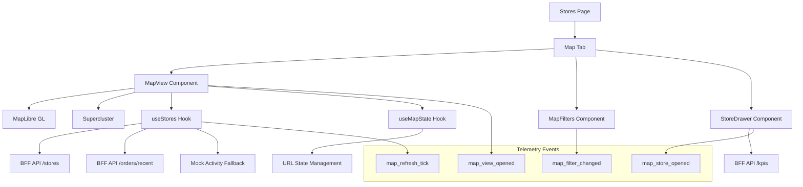

# Design Document

## Overview

The Living Map feature extends the existing Stores section with an interactive map interface that provides real-time visualization of store locations and activity. The design prioritizes minimal backend risk by leveraging existing APIs and implementing a robust frontend-only solution with graceful fallbacks.

The feature integrates seamlessly into the current navigation structure as a new tab within the Stores section, maintaining consistency with existing design patterns while introducing powerful new visualization capabilities.

## Architecture

### High-Level Architecture



### Component Hierarchy

```
/stores/map/
├── page.tsx (Map Page Container)
├── MapView.tsx (Main Map Component)
├── MapFilters.tsx (Filter Controls)
├── StoreDrawer.tsx (Store Details Drawer)
├── useMapState.ts (Map State & URL Sync)
├── useStores.ts (Store Data & Activity)
└── types.ts (Map-specific Types)
```

### Data Flow

1. **Initial Load**: Page loads with URL parameters parsed into map state
2. **Store Fetching**: useStores hook fetches store data based on current filters
3. **Activity Computation**: Attempts to fetch recent orders, falls back to mock data
4. **Map Rendering**: MapLibre renders stores with clustering and activity indicators
5. **User Interactions**: Filter changes and marker clicks trigger state updates and telemetry
6. **URL Synchronization**: All state changes are reflected in the URL for persistence

## Components and Interfaces

### Core Components

#### MapView Component
**Purpose**: Main map rendering and interaction handling
**Key Features**:
- MapLibre GL integration with vector tiles
- Supercluster for marker clustering at low zoom levels
- Activity pulse animations for stores with recent orders
- Click handling for store selection

```typescript
interface MapViewProps {
  stores: StoreWithActivity[];
  onStoreSelect: (store: StoreWithActivity) => void;
  viewport: MapViewport;
  onViewportChange: (viewport: MapViewport) => void;
}

interface MapViewport {
  latitude: number;
  longitude: number;
  zoom: number;
}
```

#### MapFilters Component
**Purpose**: Filter controls for store visibility
**Key Features**:
- Franchisee, region, and country selection
- Debounced filter application
- URL state synchronization

```typescript
interface MapFiltersProps {
  filters: FilterState;
  onFiltersChange: (filters: FilterState) => void;
  availableOptions: FilterOptions;
}

interface FilterState {
  franchiseeId?: string;
  region?: string;
  country?: string;
}
```

#### StoreDrawer Component
**Purpose**: Detailed store information display
**Key Features**:
- Store metadata display
- KPI visualization (orders today, revenue, last order)
- Navigation to detailed store view

```typescript
interface StoreDrawerProps {
  store: StoreWithActivity | null;
  isOpen: boolean;
  onClose: () => void;
  onNavigateToDetails: (storeId: string) => void;
}
```

### Custom Hooks

#### useMapState Hook
**Purpose**: Centralized map state management with URL synchronization

```typescript
interface UseMapStateReturn {
  viewport: MapViewport;
  filters: FilterState;
  setViewport: (viewport: MapViewport) => void;
  setFilters: (filters: FilterState) => void;
  selectedStoreId: string | null;
  setSelectedStoreId: (id: string | null) => void;
}
```

**Implementation Details**:
- Uses URLSearchParams for state persistence
- Debounces URL updates to prevent excessive history entries
- Provides default values for missing parameters

#### useStores Hook
**Purpose**: Store data fetching and activity computation

```typescript
interface UseStoresReturn {
  stores: StoreWithActivity[];
  loading: boolean;
  error: string | null;
  refetch: () => void;
}

interface StoreWithActivity extends Store {
  recentActivity: boolean;
  __mockActivity?: boolean; // Debug flag for mock data
}
```

**Implementation Details**:
- Fetches stores from existing `/stores` endpoint
- Attempts to fetch recent orders for activity indicators
- Falls back to mock activity data when orders unavailable
- Polls every 15 seconds for fresh data
- Debounces rapid filter changes

## Data Models

### Store Data Structure
```typescript
interface Store {
  id: string;
  name: string;
  latitude: number;
  longitude: number;
  region: string;
  country: string;
  franchiseeId?: string;
  status?: 'active' | 'inactive';
}

interface StoreWithActivity extends Store {
  recentActivity: boolean;
  __mockActivity?: boolean;
}
```

### KPI Data Structure
```typescript
interface StoreKPIs {
  ordersToday: number;
  revenueToday: number;
  lastOrderTime: string | null;
  lastOrderRelative: string; // e.g., "2 minutes ago"
}
```

### Activity Data Structure
```typescript
interface RecentOrdersResponse {
  storeId: string;
  hasRecentActivity: boolean;
  lastOrderTime?: string;
  orderCount?: number;
}
```

## Error Handling

### Graceful Degradation Strategy

1. **Map Loading Failures**:
   - Display error message with retry option
   - Fallback to list view link
   - Log error for debugging

2. **Store Data Failures**:
   - Show loading skeleton during retries
   - Display cached data if available
   - Provide manual refresh option

3. **Activity Data Failures**:
   - Automatically fall back to mock activity
   - Log warning for debugging
   - Continue normal operation

4. **KPI Data Failures**:
   - Show placeholder values
   - Display "Data unavailable" message
   - Retry on drawer reopen

### Error Boundaries
- Wrap MapView in error boundary to prevent page crashes
- Isolate drawer errors from main map functionality
- Provide fallback UI for component failures

## Testing Strategy

### Unit Tests

#### useMapState Hook Tests
```typescript
describe('useMapState', () => {
  it('should initialize from URL parameters');
  it('should update URL when state changes');
  it('should debounce URL updates');
  it('should provide default values for missing params');
});
```

#### useStores Hook Tests
```typescript
describe('useStores', () => {
  it('should fetch stores with current filters');
  it('should compute activity from recent orders');
  it('should fall back to mock activity when orders fail');
  it('should poll for updates every 15 seconds');
});
```

### Integration Tests

#### Map Component Tests
```typescript
describe('MapView', () => {
  it('should render stores as markers');
  it('should cluster markers at low zoom');
  it('should show activity pulse for active stores');
  it('should handle marker clicks');
});
```

### End-to-End Tests

#### Playwright Test Suite
```typescript
describe('Living Map', () => {
  it('should load map at /stores/map');
  it('should display clustered markers');
  it('should filter stores when filters change');
  it('should open drawer when marker clicked');
  it('should navigate to store details from drawer');
});
```

### Performance Tests
- Map rendering performance with large datasets
- Clustering performance at various zoom levels
- Memory usage during extended sessions
- Network request optimization

## Implementation Phases

### Phase 1: Core Infrastructure
- Set up routing and basic page structure
- Implement useMapState hook with URL synchronization
- Add MapLibre dependencies and basic map rendering
- Create basic store marker display

### Phase 2: Data Integration
- Implement useStores hook with API integration
- Add activity computation with fallback logic
- Implement clustering with Supercluster
- Add basic filter functionality

### Phase 3: User Interface
- Implement MapFilters component
- Add StoreDrawer with KPI display
- Implement activity pulse animations
- Add telemetry event tracking

### Phase 4: Polish and Testing
- Add comprehensive error handling
- Implement loading states and skeletons
- Add unit and integration tests
- Performance optimization and debugging

## Security Considerations

### Data Privacy
- No sensitive store data exposed in client-side code
- Activity indicators use aggregated data only
- KPI data fetched on-demand per store

### API Security
- Reuse existing authentication mechanisms
- No new API endpoints with elevated permissions
- Rate limiting handled by existing BFF infrastructure

### Client-Side Security
- Input validation for URL parameters
- XSS prevention in dynamic content rendering
- CSP compliance for MapLibre resources

## Performance Considerations

### Map Rendering Optimization
- Lazy load MapLibre CSS only on map pages
- Use clustering to reduce marker count at low zoom
- Implement viewport-based marker culling
- Optimize marker icon rendering

### Data Fetching Optimization
- Debounce filter changes to reduce API calls
- Cache store data with appropriate TTL
- Use polling with exponential backoff on errors
- Implement request deduplication

### Memory Management
- Clean up map resources on component unmount
- Limit cluster cache size
- Implement marker recycling for large datasets
- Monitor memory usage in development

## Accessibility

### Keyboard Navigation
- Tab navigation through filter controls
- Keyboard shortcuts for common actions
- Focus management in drawer component

### Screen Reader Support
- ARIA labels for map controls
- Descriptive text for store markers
- Proper heading hierarchy in drawer

### Visual Accessibility
- High contrast mode support
- Scalable marker icons
- Color-blind friendly activity indicators
- Respect user motion preferences for animations

## Browser Compatibility

### Supported Browsers
- Chrome 90+
- Firefox 88+
- Safari 14+
- Edge 90+

### Progressive Enhancement
- Graceful degradation for older browsers
- Fallback to list view for unsupported browsers
- Feature detection for advanced map capabilities

## Monitoring and Analytics

### Performance Metrics
- Map load time
- Marker rendering performance
- API response times
- Error rates by component

### Usage Analytics
- Map view frequency
- Filter usage patterns
- Store interaction rates
- Drawer engagement metrics

### Error Monitoring
- Component error boundaries
- API failure tracking
- Browser compatibility issues
- Performance bottleneck identification