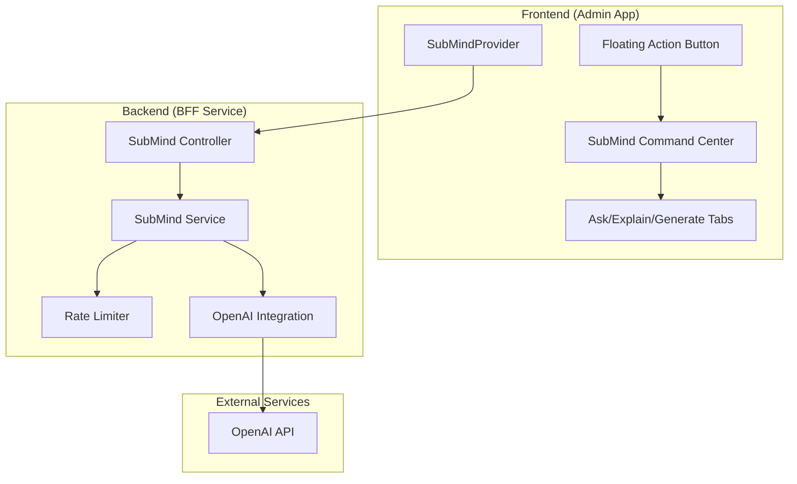

# Design Document

## Overview

SubMind is an AI-powered copilot system that integrates seamlessly into the existing Subway Enterprise architecture. The system follows a client-server pattern with a React-based frontend interface and a NestJS backend service. The design emphasizes non-intrusive integration, maintaining all existing functionality while adding intelligent assistance capabilities through a floating action button and drawer interface.

## Architecture

### High-Level Architecture



### Integration Points

The system integrates with existing infrastructure through:

1. **Layout Integration**: SubMindProvider wraps the existing layout without modifying core components
2. **API Integration**: Uses existing BFF patterns and error handling mechanisms
3. **Telemetry Integration**: Leverages current telemetry system for usage tracking
4. **Toast Integration**: Uses existing ToastProvider for error notifications
5. **Configuration Integration**: Follows existing environment variable patterns

## Components and Interfaces

### Frontend Components

#### SubMindProvider
- **Purpose**: Global state management and feature flag control
- **Location**: `apps/admin/app/components/submind/SubMindProvider.tsx`
- **Responsibilities**:
  - Feature flag checking (NEXT_PUBLIC_FEATURE_SUBMIND)
  - Global state management for drawer visibility
  - Portal rendering for floating components
  - Context provision for child components

```typescript
interface SubMindContextType {
  isOpen: boolean;
  activeTab: 'ask' | 'explain' | 'generate';
  openDrawer: () => void;
  closeDrawer: () => void;
  setActiveTab: (tab: 'ask' | 'explain' | 'generate') => void;
  isEnabled: boolean;
}
```

#### SubMindDrawer
- **Purpose**: Main interface container with tabbed navigation
- **Location**: `apps/admin/app/components/submind/SubMindDrawer.tsx`
- **Responsibilities**:
  - Right-side drawer rendering with slide animation
  - Tab navigation between Ask/Explain/Generate modes
  - Responsive design maintaining existing UI patterns
  - Close button and overlay handling

#### SubMindAsk
- **Purpose**: Freeform chat interface with context selection
- **Location**: `apps/admin/app/components/submind/SubMindAsk.tsx`
- **Responsibilities**:
  - Textarea for prompt input with character limit
  - Context picker dropdowns (region, country, store, franchisee)
  - Auto-population from current page context
  - Response rendering with markdown support
  - Copy and Create Task action buttons

#### SubMindExplain
- **Purpose**: Automated screen explanation generation
- **Location**: `apps/admin/app/components/submind/SubMindExplain.tsx`
- **Responsibilities**:
  - Route-based prompt auto-generation
  - Editable prompt preview before submission
  - Context-aware explanations for different screens
  - Integration with current page state and filters

#### SubMindGenerate
- **Purpose**: Artifact generation (CSV exports, action checklists)
- **Location**: `apps/admin/app/components/submind/SubMindGenerate.tsx`
- **Responsibilities**:
  - Executive Summary CSV generation with client-side download
  - Action Checklist creation based on current context
  - Template-based prompt generation
  - File download handling without server storage

### Backend Components

#### SubMind Controller
- **Purpose**: HTTP endpoint handling for AI queries
- **Location**: `apps/bff/src/routes/submind.controller.ts`
- **Endpoints**:
  - `POST /ai/submind/query`: Main AI query processing endpoint

```typescript
interface SubMindQueryRequest {
  prompt: string;
  context?: {
    screen?: string;
    selection?: any;
    scope?: {
      region?: string;
      country?: string;
      storeId?: string;
      franchiseeId?: string;
    };
  };
}

interface SubMindQueryResponse {
  message: string;
  sources?: Array<{
    type: 'api' | 'sql' | 'note';
    ref: string;
  }>;
  meta?: {
    tokens?: number;
    latencyMs?: number;
  };
}
```

#### SubMind Service
- **Purpose**: Core AI processing logic and OpenAI integration
- **Location**: `apps/bff/src/services/submind.service.ts`
- **Responsibilities**:
  - OpenAI API client management
  - Prompt processing and sanitization
  - Context enrichment and formatting
  - Response parsing and formatting
  - Error handling and fallback responses

#### Rate Limiter
- **Purpose**: Request rate limiting per IP address
- **Location**: `apps/bff/src/services/submind.rate-limit.ts`
- **Implementation**: Token bucket algorithm with in-memory storage
- **Configuration**: 10 requests per 60-second window per IP

```typescript
interface RateLimitBucket {
  tokens: number;
  lastRefill: number;
  windowStart: number;
}

interface RateLimitResult {
  allowed: boolean;
  remainingTokens: number;
  resetTime: number;
}
```

## Data Models

### Request/Response Models

#### AI Query Request
```typescript
interface AIQueryRequest {
  prompt: string;                    // User's input prompt (max 4000 chars)
  context?: {
    screen?: string;                 // Current page/route identifier
    selection?: any;                 // Selected items or data
    scope?: {
      region?: string;               // Current region filter
      country?: string;              // Current country filter
      storeId?: string;              // Current store context
      franchiseeId?: string;         // Current franchisee context
    };
  };
}
```

#### AI Query Response
```typescript
interface AIQueryResponse {
  message: string;                   // AI-generated response
  sources?: Array<{
    type: 'api' | 'sql' | 'note';   // Source type for transparency
    ref: string;                     // Reference identifier
  }>;
  meta?: {
    tokens?: number;                 // Token usage for monitoring
    latencyMs?: number;              // Response time for performance tracking
  };
}
```

### Context Models

#### Screen Context
```typescript
interface ScreenContext {
  route: string;                     // Current page route
  title: string;                     // Page title for context
  filters: Record<string, any>;      // Active filters
  data: any;                         // Relevant page data
}
```

#### User Scope
```typescript
interface UserScope {
  region?: string;                   // Geographic region
  country?: string;                  // Country code
  storeId?: string;                  // Store identifier
  franchiseeId?: string;             // Franchisee identifier
  permissions: string[];             // User permissions for context
}
```

## Error Handling

### Frontend Error Handling

1. **Network Errors**: Display toast notifications with retry options
2. **API Errors**: Show user-friendly messages with setup documentation links
3. **Validation Errors**: Inline validation with helpful guidance
4. **Rate Limiting**: Clear messaging about usage limits with reset timers

### Backend Error Handling

1. **Missing API Key**: Return 503 with setup instructions
2. **Rate Limiting**: Return 429 with retry-after headers
3. **Invalid Input**: Return 400 with validation details
4. **OpenAI Errors**: Return 502 with fallback suggestions
5. **Internal Errors**: Return 500 with generic error message

### Error Response Format
```typescript
interface ErrorResponse {
  error: string;                     // User-friendly error message
  code?: string;                     // Error code for programmatic handling
  details?: any;                     // Additional error context
  retryAfter?: number;               // Seconds until retry allowed (rate limiting)
}
```

## Testing Strategy

### Unit Tests

#### Frontend Tests
- Component rendering with feature flags enabled/disabled
- Context provider state management
- API client error handling
- Markdown rendering functionality
- CSV generation and download

#### Backend Tests
- Controller endpoint validation
- Service prompt processing
- Rate limiting algorithm
- OpenAI integration mocking
- Error response formatting

### Integration Tests

#### API Integration
- End-to-end query processing
- Rate limiting enforcement
- Error propagation
- Telemetry event emission

#### UI Integration
- Drawer opening/closing
- Tab navigation
- Context picker population
- Response display and actions

### E2E Tests

#### Happy Path
- Feature flag enabled → FAB visible → drawer opens → successful query
- Context picker auto-population from current page
- CSV generation and download
- Error handling with toast notifications

#### Error Scenarios
- Feature flag disabled → no UI elements
- Missing API key → setup guidance
- Rate limiting → clear messaging
- Network failures → graceful degradation

## Security Considerations

### Input Sanitization
- HTML stripping from user prompts
- Prompt length limiting (4000 characters)
- Context data validation and sanitization
- SQL injection prevention in context queries

### API Security
- Rate limiting per IP address
- Request size limiting
- CORS configuration
- Input validation with Zod schemas

### Data Privacy
- No storage of prompts or responses
- Hashed logging for debugging (no PII)
- Minimal telemetry data collection
- OpenAI API key environment variable only

## Performance Considerations

### Frontend Performance
- Lazy loading of drawer components
- Portal rendering to avoid layout thrashing
- Debounced input handling
- Minimal re-renders through optimized context

### Backend Performance
- In-memory rate limiting for speed
- Connection pooling for OpenAI API
- Request timeout handling
- Efficient prompt processing

### Monitoring
- Response time tracking
- Token usage monitoring
- Error rate alerting
- Rate limiting effectiveness metrics

## Configuration Management

### Environment Variables

#### Frontend Configuration
```bash
NEXT_PUBLIC_FEATURE_SUBMIND=true    # Feature flag for UI visibility
```

#### Backend Configuration
```bash
OPENAI_API_KEY=sk-...               # OpenAI API key (required)
SUBMIND_RATE_LIMIT_REQUESTS=10      # Requests per window (optional)
SUBMIND_RATE_LIMIT_WINDOW=60        # Window size in seconds (optional)
```

### Feature Flags
- Runtime feature toggling without deployment
- Gradual rollout capability
- A/B testing support for different AI models
- Emergency disable functionality

## Telemetry and Observability

### Frontend Events
- `ui.submind.opened`: Drawer opened
- `ui.submind.tab_changed`: Tab navigation
- `ui.submind.asked`: Query submitted
- `ui.submind.error`: Error encountered

### Backend Events
- `ai.submind.query`: Query processed
- `ai.submind.rate_limited`: Rate limit hit
- `ai.submind.error`: Processing error

### Metrics Collection
- Response latency percentiles
- Token usage distribution
- Error rate by type
- Feature adoption rates

### Event Schema
```typescript
interface TelemetryEvent {
  eventType: string;
  timestamp: string;
  userId?: string;
  sessionId?: string;
  properties: {
    screen?: string;
    scope?: UserScope;
    latencyMs?: number;
    model?: string;
    tokens?: number;
    errorType?: string;
  };
}
```