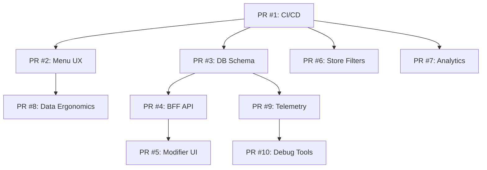

# PR Split Strategy for Multi-Phase Delivery System

## Overview
The Multi-Phase Delivery System has been designed with a strategic PR split approach to maintain manageable diff sizes (≤150 LOC where possible) and ensure each PR delivers complete, testable functionality.

## Recommended PR Sequence

### PR #1: CI/CD Infrastructure Foundation
**Estimated LOC: ~50**
**Files Changed:**
- `.github/workflows/ci.yml` (new)
- `README.md` (status badge addition)
- `turbo.json` (if CI configuration needed)

**Description:** Establishes automated CI/CD pipeline with typecheck, lint, and build processes.

**Testing:** Verify CI runs on PR creation and prevents merge on failures.

---

### PR #2: Menu Table UX Polish
**Estimated LOC: ~80**
**Files Changed:**
- `apps/admin/app/menu/components/MenuTable.tsx`
- `apps/admin/app/menu/page.tsx`
- `apps/admin/app/globals.css` (alignment styles)

**Description:** Improves menu table alignment, compacts header controls, and adds ESC key handling.

**Testing:** Manual verification of table layout and drawer behavior.

---

### PR #3: Modifier System Database Schema
**Estimated LOC: ~120**
**Files Changed:**
- `packages/db/prisma/schema.prisma`
- `packages/db/prisma/migrations/` (new migration files)
- `packages/db/prisma/seed.mjs`

**Description:** Adds ModifierGroup and MenuItemModifier models with proper relationships.

**Testing:** Migration runs successfully, seed data creates expected relationships.

---

### PR #4: Modifier System BFF API
**Estimated LOC: ~140**
**Files Changed:**
- `apps/bff/src/routes/menu.ts`
- `apps/bff/src/dto/menu.dto.ts`
- `apps/bff/src/module.ts`
- `apps/bff/test/integration/menu-modifiers.integration.test.ts`

**Description:** Implements modifier management API endpoints with validation.

**Testing:** Integration tests verify API functionality and data integrity.

---

### PR #5: Modifier Management UI
**Estimated LOC: ~150**
**Files Changed:**
- `apps/admin/app/menu/components/ItemModifiersDrawer.tsx` (new)
- `apps/admin/app/menu/page.tsx` (integration)
- `apps/admin/lib/types.ts`

**Description:** Complete modifier management interface with attach/detach functionality.

**Testing:** E2E tests verify UI to database workflow.

---

### PR #6: Cascading Store Filters
**Estimated LOC: ~130**
**Files Changed:**
- `apps/admin/app/stores/components/CascadingFilters.tsx` (new)
- `apps/admin/app/stores/page.tsx`
- `apps/bff/src/routes/stores.ts`

**Description:** Region/country/city cascading filters with query string state.

**Testing:** Filter state persistence and API integration verification.

---

### PR #7: Live Analytics Enhancement
**Estimated LOC: ~100**
**Files Changed:**
- `apps/admin/app/analytics/components/AnalyticsFilters.tsx`
- `apps/admin/app/dashboard/page.tsx`
- `apps/admin/app/globals.css` (unified styling)

**Description:** Live-updating KPI cards with unified filter styling.

**Testing:** Real-time updates without Apply button requirement.

---

### PR #8: Menu Data Ergonomics
**Estimated LOC: ~110**
**Files Changed:**
- `apps/admin/app/menu/components/ItemDrawer.tsx`
- `apps/admin/lib/hooks/useEnhancedMenuItemForm.ts`
- `apps/admin/app/components/ToastProvider.tsx`

**Description:** Smart defaults, auto-focus, validation, and success feedback.

**Testing:** Form behavior and validation edge cases.

---

### PR #9: Telemetry Infrastructure
**Estimated LOC: ~140**
**Files Changed:**
- `packages/db/prisma/schema.prisma` (telemetry tables)
- `packages/db/prisma/migrations/` (new migration)
- `apps/bff/src/routes/telemetry.ts` (new)
- `apps/bff/src/dto/telemetry.dto.ts` (new)

**Description:** Feature flags and telemetry event tracking infrastructure.

**Testing:** Event validation and storage verification.

---

### PR #10: Debug Tooling and System Integrity
**Estimated LOC: ~90**
**Files Changed:**
- `apps/admin/app/components/TelemetryDebug.tsx` (new)
- Various files (TypeScript any type fixes)
- `apps/admin/docs/telemetry-debug.md`

**Description:** Development debug tools and code quality improvements.

**Testing:** Debug functionality and type safety verification.

## PR Dependencies

## Benefits of This Approach

### Manageable Review Size
- Each PR stays within ~150 LOC limit
- Focused scope makes reviews more thorough
- Easier to identify and fix issues

### Incremental Value Delivery
- Each PR delivers complete, testable functionality
- Users see improvements progressively
- Reduced risk of large-scale rollbacks

### Parallel Development
- Independent PRs can be developed simultaneously
- Team members can work on different phases
- Faster overall delivery timeline

### Quality Assurance
- Smaller changes easier to test thoroughly
- Issues isolated to specific functionality
- Better test coverage per feature

## Merge Strategy

### Sequential Merging (Recommended)
1. Merge PRs in dependency order
2. Verify each PR in staging before next merge
3. Monitor for regressions between merges

### Parallel Merging (Advanced)
- Independent PRs can merge in parallel
- Requires careful conflict resolution
- Best for experienced teams

## Rollback Strategy

### Individual PR Rollback
- Each PR can be reverted independently
- Minimal impact on other functionality
- Clear rollback boundaries

### Partial Feature Rollback
- Disable specific phases without affecting others
- Feature flags can control visibility
- Gradual rollback possible

## Testing Strategy Per PR

### Unit Tests
- Each PR includes relevant unit tests
- Test coverage maintained above 80%
- Mock external dependencies

### Integration Tests
- API endpoints tested with real database
- Component integration verified
- Error scenarios covered

### E2E Tests
- Critical user journeys tested
- Cross-browser compatibility
- Performance impact measured

## Documentation Requirements

### Each PR Must Include:
- Clear description of changes
- Screenshots for UI changes
- Manual testing checklist
- Migration instructions (if applicable)
- Environment variable changes (if any)

### Cumulative Documentation:
- Architecture decision records
- API documentation updates
- User guide updates
- Deployment guide updates

This strategy ensures maintainable, reviewable, and reliable delivery of the Multi-Phase Delivery System while minimizing risk and maximizing team productivity.